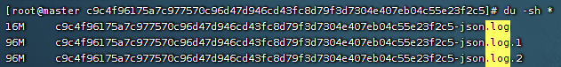

```shell
# 查询占用磁盘较大的文件-升序
du -d1 -h /var/lib/docker/containers | sort -h
 ```
## 控制容器日志大小
### 方法一
#### docker
```shell
# max-size：容器日志最大100M
# max-file：最大日志数3个（ ex: *-json.log, *-json.log.1, *-json.log.2 ）
docker run -it --log-opt max-size=100m --log-opt max-file=3 redis
 ```
日志目录/var/lib/docker/containers


观察日志的增长，你会发现当`xxx.log`日志文件到达设置的最大日志量后，会变成`xxx.log.1`，`xxx.log.2`文件...

#### docker-compose
```yaml
services:
  test:
    image: xxx
    # 日志
    logging:
      driver: "json-file"   # 默认的文件日志驱动
      options:
        max-size: "100m"    # 单个日志文件大小为100m
        max-file: "3"       # 最多3个日志文件
```

### 方法二：全局配置
> 温馨提示：新容器生效
```shell
# 创建或修改`daemon.json`文件
cat /etc/docker/daemon.json

# 新增如下配置
{
    "log-driver": "json-file",
    "log-opts": {
        "max-size":"100m",  # 单个日志文件最大100m
        "max-file":"3" # 最多3个日志文件
    }
}

# 重启docker
systemctl daemon-reload
systemctl restart docker
```

## 脚本
### 清理日志脚本
> docker-log-clean.sh
```shell
#!/bin/bash

####################################
# @description 清理docker容器日志
# @params $? => 代表上一个命令执行后的退出状态: 0->成功,1->失败
# @example => sh docker_log_clean.sh
####################################

# 在执行过程中若遇到使用了未定义的变量或命令返回值为非零，将直接报错退出
set -eu

echo "================== ↓↓↓↓↓↓ 清理docker容器日志 ↓↓↓↓↓↓ =================="

logs=$(find /var/lib/docker/containers/ -name '*-json.log*')

for log in $logs
do
    echo "clean log: $log"
    cat /dev/null > $log
done

echo "===================================================================="

```

### 查看docker容器日志大小
```shell
#!/bin/bash

####################################
# @description 查看docker容器日志大小
# @params $? => 代表上一个命令执行后的退出状态: 0->成功,1->失败
# @example => sh docker_log_size_show.sh
####################################

# 在执行过程中若遇到使用了未定义的变量或命令返回值为非零，将直接报错退出
set -eu

echo "================== ↓↓↓↓↓↓ 查询docker容器日志大小 ↓↓↓↓↓↓ ================"

logs=$(find /var/lib/docker/containers/ -name '*-json.log*')

for log in $logs
do
    ls -lh $log
done

echo "===================================================================="

 ```
