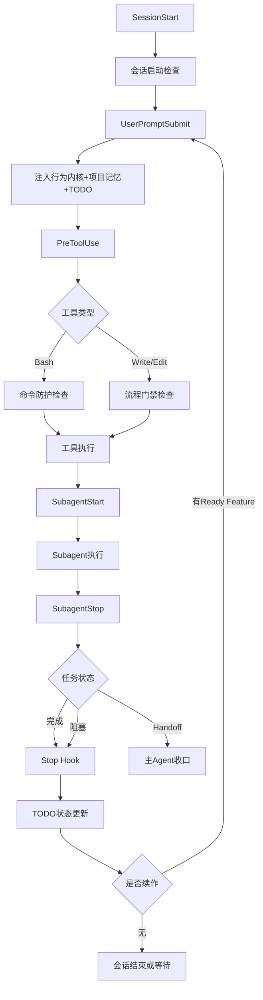

import { Aside } from '@astrojs/starlight/components'

## 概述

Runtime Hooks 在 Claude Code 和 Codex 的关键生命周期节点自动接管一部分工作：把统一的行为原则和项目事实带进上下文、提醒当前 TODO、拦下明显危险的命令、在任务完成或需要你决定时发出提示音。装好之后不需要你在每轮对话里手动交代这些。

**你会得到什么**：

- **跨客户端一致**：Claude Code 和 Codex 用同一套原则和同一份项目记忆
- **轻量注入**：只带入当前这轮请求真正相关的事实，不灌整份清单
- **流程连续**：TODO 状态自动推进，一个功能收口后自动接下一个
- **危险操作前置拦截**：递归强制删除、强制推送、清库一类命令会被直接拒绝

## Hook 生命周期



## 七个 Hook 分别做什么

| Hook | 触发时机 | 你能观察到的效果 | 详细文档 |
|------|----------|------------------|----------|
| SessionStart | 会话启动 | 配置过时时自动对齐；报告 Penpot MCP 本地注册状态 | [查看](/skills/hooks/session-start/) |
| UserPromptSubmit | 每次提交提示词 | 注入行为内核、项目记忆摘要、当前 TODO 提醒 | [查看](/skills/hooks/user-prompt-submit/) |
| PreToolUse | 每个工具调用前 | 拒绝破坏性命令；规划阶段拒绝写生产文件 | [查看](/skills/hooks/pre-tool-use/) |
| SubagentStart | Subagent 启动 | 子任务拿到与主会话一致的上下文 | [查看](/skills/hooks/subagent-start/) |
| SubagentStop | Subagent 停止 | 校验 Handoff 信息是否齐全 | [查看](/skills/hooks/subagent-stop/) |
| Stop | 主会话停止 | 更新 TODO 状态、核验推送、自动续作下一项 | [查看](/skills/hooks/stop/) |
| PermissionRequest | 需要你授权时 | 播放"需要确认"提示音 | [查看](/skills/hooks/notification/) |

<Aside type="caution">
两端的事件集合不完全相同：`PermissionRequest` 只有 Claude Code 有，Codex 侧同样的通知走 `~/.codex/config.toml` 里的用户级 `notify` 通道。逐事件对照见 [排障页](/skills/hooks/troubleshooting/)。
</Aside>

## 每轮注入了什么

上下文注入是这套机制里最常被感知到的部分。每轮请求会带入四样东西：跨客户端统一的行为原则、从仓库 `PROJECT-MEMORY.md` 里按当前问题挑出的事实摘要、当前 Git 身份对应的 TODO 归属范围，以及本实例已领取的那一项功能。

注入的是**摘要而不是全文**，并且有总量上限：超出时会自动截断，并提示你直接读取源文件。看到注入块被截断，正确做法是打开对应的 TODO 或 `PROJECT-MEMORY.md`，而不是想办法把内容塞回注入。

<Aside type="note">
Hook 不注入完整 Skill 清单或 Skill 正文，这些由客户端自身的 Skill 发现机制提供。
</Aside>

## 核心能力

### 1. 行为内核注入

每次用户请求和 Subagent 启动时，自动带入一组统一原则：事实先行、简单优先、最小写集、目标驱动、按需加载、有界推进。它是所有客户端共用的同一份内容，改一次两端同时生效。

### 2. 项目记忆自动维护

- 自动确保目标仓库根目录有一份 `PROJECT-MEMORY.md`
- 首次创建、或主要章节还是模板占位内容时，提示先走 `init-docs` 采集事实
- 只注入与当前问题相关的摘要，不注入全文
- 确认后的稳定事实由 `project-details` 原位归并

### 3. TODO 状态机

任务状态由 Hook 原子写回，不需要（也不允许）手工编辑 TODO 文件：领取、依赖检查、写集冲突检测、完成门禁、远端核验、自动续作，整条链路自动完成。

### 4. 命令防护

明确会被**拒绝**的是这几类：递归强制删除整体目录、强制推送或删除远端 ref、丢弃工作区状态、清空数据库、递归改根目录权限。完整对照表见 [排障页](/skills/hooks/troubleshooting/)。

<Aside type="caution">
敏感信息检查不是防泄露手段。按默认配置，它既不会拦住你，也不会提示你。不要指望 Hook 帮你挡住误提交的密钥，请用 `.gitignore`、`git-secrets` 一类专门工具。
</Aside>

### 5. 流程门禁

新需求推进到 `business-development` 阶段之前，Write/Edit 生产文件会被拒绝，只允许只读调查和规划文档写入。目的是强制先完成需求确认、技术方案和任务拆分。

### 6. 中文提示音

三类状态各有一个提示音：需要你确认、回复完成、任务完成。分类由回复末尾的不可见标记决定，详见 [中文语音通知](/skills/hooks/notification/)。

## 安装和配置

```bash
# 安装（幂等，可重复运行）
node runtime-hooks/scripts/install.mjs

# 检查安装状态
node runtime-hooks/scripts/install.mjs --check --json
```

Codex 使用非托管 Hook，安装后需要在会话里信任一次：

```bash
codex
/hooks
# 审查并信任所有 Hook
```

👉 [完整安装指南](/skills/hooks/installation/)

## 环境变量

| 变量 | 设置后的效果 |
|------|--------------|
| `AGENT_RUNTIME_HOOKS_DISABLED=1` | 停用命令防护、启动检查和提示音 |
| `AGENT_COMMAND_GUARD=0` | 只停用命令防护 |
| `AGENT_RUNTIME_HOOKS_AUTO_UPDATE=0` | 配置版本不一致时不自动重装，只打印手动安装命令 |
| `AGENT_RUNTIME_WARNINGS=1` | 打开风险提示（默认关闭；提示不会阻断执行） |
| `AGENT_COMPLETION_SOUND=0` | 关闭全部提示音 |
| `AGENT_DEVELOPER_NAME` | 指定开发者 ID，仅在 Git identity 不可用时生效 |
| `AGENT_TODO_DIR` | 显式指向自己的规范 TODO 目录 |
| `AGENT_ACTIVE_TODO` | 本次会话指定活动 TODO 文件名 |
| `AGENT_RUNTIME_INSTANCE_ID` | 提供运行实例 ID，仅在客户端未提供时需要 |
| `CLAUDE_CONFIG_DIR` / `CODEX_HOME` | 改写两端配置目录位置 |

<Aside type="caution">
`AGENT_RUNTIME_HOOKS_DISABLED` 的名字听起来像总开关，但它关不掉全部 Hook——上下文注入和 TODO 续作照常运行。要彻底停掉某个 Hook，请删掉客户端配置里对应的条目，或恢复安装器留下的 `.backup-*` 文件。
</Aside>

## 你会看到的实际行为

危险命令被拒绝：

```bash
# ❌ 拒绝
rm -rf .
git push --force
psql -c "TRUNCATE TABLE users"

# ✅ 放行
rm specific-file.txt
rm -rf ./build
git push origin feature/x
```

规划阶段写生产文件被拒绝：

```bash
# ❌ 拒绝：流程还没推进到 business-development
Write src/api/user.ts

# ✅ 放行：规划文档
Write docs/design.md
```

## 故障排查

| 症状 | 可能原因 | 怎么处理 |
|------|----------|----------|
| Hook 没生效 | 安装不完整，或没重启会话 | 运行 `install.mjs --check --json`，Claude Code 重启会话、Codex 重新信任 |
| 找不到 TODO | Git `user.name` 未配置 | `git config user.name "alice-chen"` |
| 命令被拦 | 命中命令防护 | 确认命令是否真的需要，需要时由你在终端手动执行 |
| 续作没发生 | 依赖未满足、写集冲突，或正在等你确认 | 检查 TODO 依赖与当前状态 |

👉 [完整故障排查指南](/skills/hooks/troubleshooting/)

## 下一步

- [安装指南](/skills/hooks/installation/) —— 详细安装、更新与卸载步骤
- [PreToolUse Hook](/skills/hooks/pre-tool-use/) —— 命令防护与流程门禁
- [UserPromptSubmit Hook](/skills/hooks/user-prompt-submit/) —— 注入内容详解
- [Stop Hook](/skills/hooks/stop/) —— TODO 续作详解
- [故障排查](/skills/hooks/troubleshooting/) —— 常见问题处理

<Aside type="note">
Hook 随 Skills 仓库一起分发，位于 `<skills-root>/runtime-hooks/`（`<skills-root>` 是你克隆 Skills 仓库的目录，默认 `~/.agent-workflow/skills`）。
</Aside>
