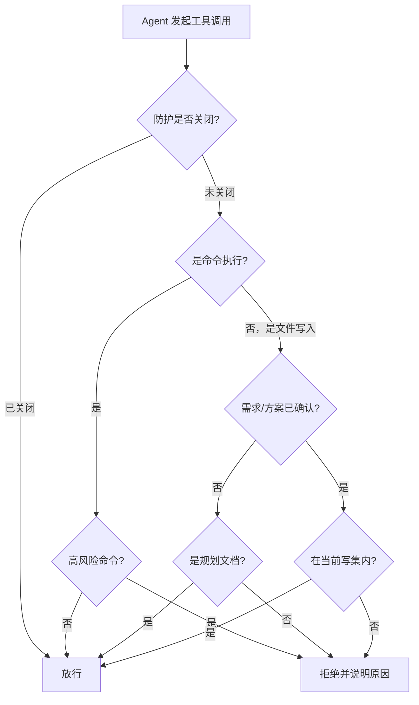

import { Aside } from '@astrojs/starlight/components'

## 这个 Hook 帮你做什么

PreToolUse Hook 在 Agent 真正执行工具调用之前介入，把三类你不希望"先做了再说"的操作挡在外面：

| 拦截类别 | 你会撞上的场景 | 结果 |
|---------|--------------|------|
| 高风险命令 | Agent 准备执行 `rm -rf`、强制推送、`DROP TABLE` | 直接拒绝 |
| 研发流程门禁 | 需求或方案还没确认，Agent 想动生产代码 | 直接拒绝 |
| 写集越界 | Agent 想改的文件不在当前 Feature 声明的写集里 | 直接拒绝 |
| 中风险操作 | 改文件权限之类 | 只提醒，不拦 |

被拒绝时，Agent 会在对话里收到拒绝原因，通常会自己换一种做法或者回来问你。你看到的是一条中文提示，不是命令执行失败。

## 会在哪些工具调用前生效

| 工具类型 | 典型工具 | 检查什么 |
|---------|---------|---------|
| 命令执行 | Bash、exec_command | 高风险命令 |
| 文件写入 | Write、Edit、MultiEdit | 流程门禁、写集 |
| Notebook 编辑 | NotebookEdit | 流程门禁 |
| 补丁应用 | apply_patch | 流程门禁 |

## 会被拒绝的高风险命令

### 递归删除

```bash
# ❌ 拒绝
rm -rf /
rm -rf ~
rm -rf ~/important-dir
find . -name "*.log" -delete

# ✅ 允许（目标明确）
rm -rf ./temp/specific-dir
rm specific-file.txt
```

拒绝理由：影响范围不可控、难以回滚、可能删到系统文件。

### 强制推送与远端 ref 改写

```bash
# ❌ 拒绝（强制推送）
git push --force
git push -f
git push --force-with-lease

# ❌ 拒绝（改写或删除远端 ref）
git push --delete origin feature-x
git push --mirror
git push origin +main:main
git push origin :feature-x

# ✅ 允许
git push
git push origin feature-branch
```

判定不是简单的字符串匹配：短选项聚合（如 `-uf`）一样算强制推送，`sh -c "git push --force"` 这种套一层壳的写法也会被识别出来。

拒绝理由：覆盖远端历史、影响团队其他人、恢复代价高。

### 数据库结构删除

```bash
# ❌ 拒绝
DROP TABLE users
DROP DATABASE production
TRUNCATE TABLE orders

# ✅ 允许
DELETE FROM users WHERE id = 123
SELECT * FROM users
```

拒绝理由：数据不可恢复，需要先有备份和回滚计划。

### 大范围权限修改

```bash
# ❌ 拒绝
chmod -R 777 /
chown -R root:root /home

# ✅ 允许
chmod +x script.sh
chown $USER:$USER file.txt
```

### 确认安全时放行

```bash
# 单次会话关闭命令防护
AGENT_COMMAND_GUARD=0 claude

# 或在当前 shell 里关闭
export AGENT_COMMAND_GUARD=0
```

<Aside type="caution">
只在完全理解命令影响、并且有可用备份时关闭防护。关掉之后上面这些命令会原样执行。
</Aside>

## 关于敏感信息

<Aside type="caution">
**不要把 Hook 当作密钥泄露的防线。** 按默认配置，敏感信息检查不会拦下你的操作。它不能替代 `.gitignore`、`git-secrets` 或服务端的 secret scanning——防止密钥进入仓库仍然是你自己的责任。
</Aside>

实践上仍然建议：密钥放 `.env` 并加入 `.gitignore`，命令里用 `$VAR` 或从文件读取，而不是把明文粘进对话或脚本。

```bash
# 建议
TOKEN=$(cat token.txt)
curl -H "Authorization: Bearer $TOKEN" ...
```

## 研发流程门禁

需求和技术方案还没确认时，Hook 会拒绝对生产代码的写入，只放行规划类文档。这样可以避免"边聊需求边改代码"，最后谁也说不清实现依据是什么。

**被拦的样子：**

```
当前处于规划阶段，禁止修改生产文件。请先完成需求确认和技术方案。
```

**这时允许写的文件：**

| 扩展名 | 用途 |
|-------|------|
| `.md` | Markdown 文档 |
| `.txt` | 纯文本 |
| `.mmd` | Mermaid 图 |
| `.puml` | PlantUML 图 |
| `.drawio` | 流程图 |
| `.adoc` | AsciiDoc |
| `.rst` | reStructuredText |

**怎么继续：**

1. 让 Agent 把需求和验收标准写清楚，你确认一遍；
2. 确认技术方案；
3. 确认完成后流程会推进到实现阶段，生产文件写入自动放行。

如果你只是想先记录想法，把内容写进上面那些文档格式里即可，不会被拦。

<Aside type="note">
没有建立规划流程的仓库不受这条门禁影响，写生产文件不会被拒绝。
</Aside>

## 写集越界

TODO 里每个 Feature 会声明自己的写集，也就是这个 Feature 允许改哪些文件：

```markdown
- [~] `USER-LOGIN` 用户登录
  - 依赖: USER-REG
  - 写集: src/api/user/login.ts, src/pages/login.vue, src/router/index.ts
```

写集有两个作用：让并行任务不会同时改同一个文件，以及在改动范围悄悄扩大时提醒你。

**被拦的样子：**

```
文件 src/components/Header.vue 不在当前 Feature 写集内。
请先更新 TODO 写集或创建独立任务。
```

**两种处理方式：**

```bash
# 方式 1：这个文件确实属于当前 Feature，补进写集
vim docs/<developer-id>/tasks/todo/project.md
# 在当前 Feature 的写集里加上该文件

# 方式 2：这是另一件事，单独开任务
"添加优化 Header 组件的任务"
```

并行开发时如果两个 Feature 的写集有交集，后领取的那个会被拒绝领取，避免两边同时改一个文件。把冲突文件的改动收在一个 Feature 里，或者拆开时间顺序做。

## 提醒模式

中风险操作默认只提醒不拦截，需要显式打开：

```bash
export AGENT_RUNTIME_WARNINGS=1
```

打开后的效果：

```bash
# Agent 执行
chmod 755 script.sh

# 你会看到
⚠️  运行时安全提醒：修改文件权限。请核对目标与回滚方式。
```

命令照常执行，只是多一条提示。

## 判断流程



## 配置

| 环境变量 | 设成什么 | 效果 |
|---------|---------|------|
| `AGENT_RUNTIME_HOOKS_DISABLED` | `1` | 关闭全部 Hook，包括本页所有检查 |
| `AGENT_COMMAND_GUARD` | `0` | 只关闭高风险命令拦截，其余检查保留 |
| `AGENT_RUNTIME_WARNINGS` | `1` | 打开中风险操作提醒 |

环境变量要在启动客户端**之前**导出，Hook 进程才继承得到：

```bash
# 单次会话
AGENT_COMMAND_GUARD=0 claude

# 当前 shell 内长期生效
export AGENT_COMMAND_GUARD=0
```

## 故障排查

### 合法命令被拦下

先看拒绝原因里指出的是哪一类模式。常见情况是命令里带了通配符或递归标志，改成明确目标即可：

```bash
# 改写前
rm -rf *

# 改写后
rm -rf ./build
```

确认无风险又必须原样执行时，用 `AGENT_COMMAND_GUARD=0` 单次放行。

### 明明在实现阶段却被门禁拦住

说明流程状态还停在确认之前。让 Agent 先把需求确认和方案确认走完，再回到实现；不要用关闭 Hook 的方式绕过——绕过之后没人知道这段代码依据的是哪版需求。

### 写集报错但文件确实要改

按上面"写集越界"两种处理方式之一操作。不建议把写集写成整个目录，那样并行冲突检测就失效了。

### 想确认某条命令会不会被拦

在会话里直接让 Agent 试一次最安全：被拦会立刻给出中文原因，被放行则说明这条命令不在拦截范围内。

## 下一步

- [UserPromptSubmit Hook](/skills/hooks/user-prompt-submit/) - 上下文注入
- [Stop Hook](/skills/hooks/stop/) - TODO 续作
- [故障排查](/skills/hooks/troubleshooting/) - 更多常见问题
- [最佳实践](/skills/best-practices/) - 少踩防护
