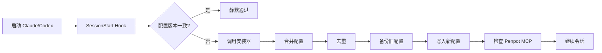
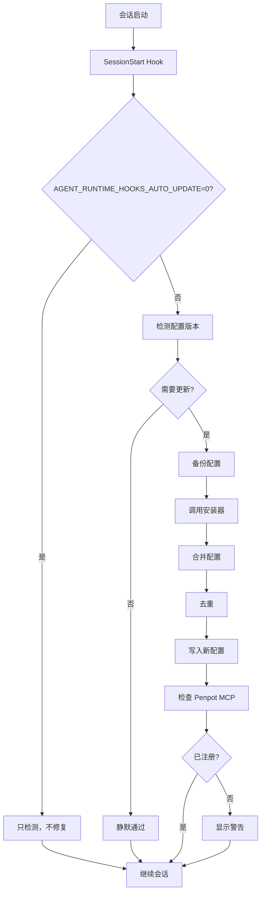

import { Aside } from '@astrojs/starlight/components'

## 概述

SessionStart Hook 在会话启动时触发，负责检查 Hook 配置版本、自动修复过时配置、检查 Penpot MCP 注册状态，确保运行环境就绪。

**关键职责**：
- **版本检测**：对比配置文件与仓库版本
- **自动修复**：合并、去重、备份过时配置
- **MCP 检查**：验证 Penpot MCP 本地注册（不连接）
- **静默运行**：配置已是最新时无输出

## 触发时机



**每次会话启动时触发**，包括：
- 首次启动客户端
- 重启客户端
- 新建会话窗口

## 版本检测

### 配置文件位置

| 客户端 | 配置文件路径 |
|--------|-------------|
| Claude Code | `~/.claude/settings.json` |
| Codex | `~/.config/codex/settings.json` |

### 版本对比

```javascript
function checkHookVersion(clientConfig, repoHooks) {
  // 1. 读取客户端配置中的 Hook 定义
  const installedHooks = clientConfig.hooks || {};
  
  // 2. 读取仓库中的 Hook 脚本路径
  const expectedHooks = {
    SessionStart: path.join(skillsRoot, 'runtime-hooks/scripts/session-start.cjs'),
    PreToolUse: path.join(skillsRoot, 'runtime-hooks/scripts/pre-tool-use.cjs'),
    UserPromptSubmit: path.join(skillsRoot, 'runtime-hooks/scripts/skill-catalog-context.cjs'),
    SubagentStart: path.join(skillsRoot, 'runtime-hooks/scripts/skill-catalog-context.cjs'),
    SubagentStop: path.join(skillsRoot, 'runtime-hooks/scripts/todo-continuation.cjs'),
    Stop: path.join(skillsRoot, 'runtime-hooks/scripts/todo-continuation.cjs'),
  };
  
  // 3. 对比
  for (const [hookName, expectedPath] of Object.entries(expectedHooks)) {
    const installed = installedHooks[hookName];
    
    if (!installed) {
      return { needsUpdate: true, reason: `缺少 ${hookName}` };
    }
    
    const installedPath = installed.args?.[0] || installed.command;
    if (installedPath !== expectedPath) {
      return { needsUpdate: true, reason: `${hookName} 路径不匹配` };
    }
  }
  
  return { needsUpdate: false };
}
```

### 检测差异

SessionStart Hook 会检测以下差异：

#### 1. 缺少 Hook

```json
// 配置文件中缺少某个 Hook
{
  "hooks": {
    "PreToolUse": { ... },
    "UserPromptSubmit": { ... }
    // 缺少 SessionStart, SubagentStart, SubagentStop, Stop
  }
}
```

**行为**：调用安装器补充缺失的 Hook。

#### 2. 路径不匹配

```json
// 旧路径
{
  "hooks": {
    "SessionStart": {
      "command": "node",
      "args": ["/old/path/runtime-hooks/scripts/session-start.cjs"]
    }
  }
}

// 新路径
/Users/username/.agent-workflow/skills/runtime-hooks/scripts/session-start.cjs
```

**行为**：更新为新路径。

#### 3. 遗留的旧版本配置

```json
// 旧版本遗留的 Penpot 启动命令
{
  "hooks": {
    "SessionStart": {
      "command": "bash",
      "args": ["-c", "penpot-mcp-start.sh && node session-start.cjs"]
    }
  }
}
```

**行为**：移除遗留命令，保留新版本配置。

## 自动修复

### 调用安装器

当检测到差异时，SessionStart Hook 会调用安装器：

```javascript
function autoRepair() {
  const installerPath = path.join(skillsRoot, 'runtime-hooks/scripts/install.mjs');
  
  console.log('检测到 Hook 配置差异，正在自动修复...');
  
  // 调用安装器
  const result = execSync(`node ${installerPath}`, {
    encoding: 'utf8',
    stdio: 'pipe'
  });
  
  console.log('✓ Hook 配置已更新');
  
  return { repaired: true };
}
```

### 合并策略

安装器使用以下策略合并配置：

#### 1. 保留非 Hook 配置

```json
// 原配置
{
  "theme": "dark",
  "model": "opus",
  "hooks": { ... }
}

// 合并后
{
  "theme": "dark",  // 保留
  "model": "opus",  // 保留
  "hooks": { ... }  // 更新
}
```

#### 2. 去重 Hook 定义

```json
// 如果同一个 Hook 有多个定义，保留最新的
{
  "hooks": {
    "PreToolUse": { ... },  // 旧定义
    "PreToolUse": { ... }   // 新定义 (保留)
  }
}
```

#### 3. 移除遗留命令

```json
// 移除旧版本的 Penpot 启动命令
{
  "hooks": {
    "SessionStart": {
      // 移除: penpot-mcp-start.sh
      // 保留: session-start.cjs
    }
  }
}
```

### 备份机制

修改前自动备份：

```javascript
function backupConfig(configPath) {
  const timestamp = new Date().toISOString().replace(/[:.]/g, '-').slice(0, 19);
  const backupPath = `${configPath}.backup-${timestamp}`;
  
  fs.copyFileSync(configPath, backupPath);
  
  console.log(`配置已备份: ${backupPath}`);
  
  return backupPath;
}
```

**备份文件示例**：
```
~/.claude/settings.json.backup-2026-09-03T10-30-45
~/.config/codex/settings.json.backup-2026-09-03T10-30-45
```

<Aside type="tip">
备份文件会一直保留，可以手动删除旧备份以节省空间。
</Aside>

## Penpot MCP 检查

### 只读检查

SessionStart Hook 只检查 Penpot MCP 的**本地注册状态**，不执行注册或连接：

```javascript
function checkPenpotMCP(client) {
  const scriptPath = path.join(skillsRoot, 'project-manager/scripts/penpot-mcp-setup.mjs');
  
  // 只检查注册状态，不连接
  const result = execSync(
    `node ${scriptPath} --check --json --client=${client}`,
    { encoding: 'utf8' }
  );
  
  const status = JSON.parse(result);
  
  return status;
}
```

**输出示例**：

```json
{
  "registered": true,
  "client": "claude-code",
  "serverName": "penpot",
  "serverUrl": "https://ui.qiucou.cn/mcp/stream"
}
```

### 不触发连接

<Aside type="caution">
SessionStart Hook **不会**连接 Penpot 服务器。实际连接只在用户明确使用 penpot Skill 时才发生。
</Aside>

**检查内容**：
- ✅ 客户端 MCP 配置是否包含 penpot server
- ✅ 配置中的 URL 和 token 是否存在
- ❌ 不测试网络连接
- ❌ 不验证 token 有效性
- ❌ 不调用任何 MCP 工具

### 检查失败处理

如果 Penpot MCP 未注册：

```javascript
if (!status.registered) {
  console.warn('⚠️  Penpot MCP 未注册，部分 Skill 可能不可用');
  console.warn('运行以下命令注册: node project-manager/scripts/penpot-mcp-setup.mjs');
  
  // 不阻止会话启动
  return { warning: true };
}
```

**行为**：
- ✅ 显示警告
- ✅ 继续会话启动
- ❌ 不强制注册
- ❌ 不阻止使用

## 静默模式

### 配置已是最新

当配置版本与仓库一致时，SessionStart Hook 静默通过：

```javascript
function handleSessionStart() {
  const versionCheck = checkHookVersion();
  
  if (!versionCheck.needsUpdate) {
    // 静默通过，无输出
    return { silent: true };
  }
  
  // 需要更新时才有输出
  autoRepair();
}
```

**用户体验**：
- ✅ 配置正确：无输出，快速启动
- ⚠️ 配置过时：显示修复进度
- ❌ 修复失败：显示错误信息

### 输出示例

**首次安装后**：
```
$ claude
正在检查 Runtime Hook 版本...
✓ Hook 配置已是最新
```

**后续启动**：
```
$ claude
(无输出，直接进入会话)
```

**检测到差异**：
```
$ claude
检测到 Hook 配置差异，正在自动修复...
配置已备份: ~/.claude/settings.json.backup-2026-09-03T10-30-45
安装 Hook: SessionStart
安装 Hook: SubagentStart
✓ Hook 配置已更新
```

## 禁用自动修复

如果不希望 SessionStart 自动修复：

```bash
# 禁用自动修复
export AGENT_RUNTIME_HOOKS_AUTO_UPDATE=0

# 永久设置
echo 'export AGENT_RUNTIME_HOOKS_AUTO_UPDATE=0' >> ~/.zshrc
source ~/.zshrc
```

**行为**：
- ❌ 不自动调用安装器
- ✅ 仍然检测差异
- ⚠️ 显示警告信息
- ✅ 继续会话启动

**输出示例**：
```
$ claude
⚠️  检测到 Hook 配置差异，但自动修复已禁用
运行以下命令手动更新: node ~/.agent-workflow/skills/runtime-hooks/scripts/install.mjs
```

## 工作原理

### 执行流程



### 输入格式

SessionStart Hook 通过 stdin 接收 JSON 输入：

```json
{
  "sessionId": "abc123",
  "client": "claude-code",
  "configPath": "/Users/username/.claude/settings.json",
  "skillsRoot": "/Users/username/.agent-workflow/skills"
}
```

### 输出格式

Hook 通过 stdout 返回 JSON 输出：

**无需更新**：
```json
{}
```

**已修复**：
```json
{
  "systemMessage": "✓ Hook 配置已更新"
}
```

**禁用自动修复**：
```json
{
  "systemMessage": "⚠️  检测到 Hook 配置差异，但自动修复已禁用\n运行以下命令手动更新: node ~/.agent-workflow/skills/runtime-hooks/scripts/install.mjs"
}
```

## 配置选项

### 环境变量

```bash
# 禁用自动修复
export AGENT_RUNTIME_HOOKS_AUTO_UPDATE=0

# 完全禁用 Hook（包括 SessionStart）
export AGENT_RUNTIME_HOOKS_DISABLED=1
```

### 手动触发修复

```bash
# 手动运行安装器
node ~/.agent-workflow/skills/runtime-hooks/scripts/install.mjs

# 检查状态
node ~/.agent-workflow/skills/runtime-hooks/scripts/install.mjs --check --json
```

## 故障排查

### SessionStart 每次都重装

**症状**：每次启动会话都显示"正在自动修复"。

**原因**：版本检测认为配置不一致。

**诊断**：

```bash
# 1. 检查配置文件
cat ~/.claude/settings.json | grep -A 20 hooks

# 2. 检查仓库路径
ls -la ~/.agent-workflow/skills/runtime-hooks/scripts/

# 3. 手动检查版本
node ~/.agent-workflow/skills/runtime-hooks/scripts/install.mjs --check --json
```

**解决方案**：

```bash
# 方案 1：禁用自动修复
export AGENT_RUNTIME_HOOKS_AUTO_UPDATE=0

# 方案 2：手动修复一次
node ~/.agent-workflow/skills/runtime-hooks/scripts/install.mjs

# 方案 3：删除旧配置重新安装
mv ~/.claude/settings.json ~/.claude/settings.json.old
node ~/.agent-workflow/skills/runtime-hooks/scripts/install.mjs
```

### 备份文件过多

**症状**：`~/.claude/` 目录下有大量 `.backup-*` 文件。

**清理方法**：

```bash
# 查看备份文件
ls ~/.claude/settings.json.backup-*

# 只保留最近 5 个备份
ls -t ~/.claude/settings.json.backup-* | tail -n +6 | xargs rm

# 或全部删除（谨慎）
rm ~/.claude/settings.json.backup-*
```

<Aside type="caution">
删除前确认当前配置正常工作。
</Aside>

### 权限问题

**症状**：

```
Error: EACCES: permission denied, open '~/.claude/settings.json'
```

**解决方案**：

```bash
# 修复文件权限
chmod 600 ~/.claude/settings.json

# 修复目录权限
chmod 700 ~/.claude

# 修复所有者
sudo chown -R $USER ~/.claude
```

### Penpot MCP 检查失败

**症状**：

```
⚠️  Penpot MCP 检查失败
```

**诊断**：

```bash
# 手动检查
node ~/.agent-workflow/skills/project-manager/scripts/penpot-mcp-setup.mjs --check --json
```

**解决方案**：

```bash
# 如果未注册
node ~/.agent-workflow/skills/project-manager/scripts/penpot-mcp-setup.mjs

# 如果不需要 Penpot，忽略警告即可
```

## 与安装器的关系

SessionStart Hook 与安装器的分工：

| 功能 | SessionStart Hook | 安装器 (install.mjs) |
|------|------------------|---------------------|
| 触发时机 | 每次会话启动 | 用户手动调用 |
| 版本检测 | ✅ | ✅ |
| 自动修复 | ✅（可禁用） | ✅（始终执行） |
| 备份配置 | ✅ | ✅ |
| Penpot 检查 | ✅（只读） | ✅（只读） |
| 用户交互 | ❌（静默） | ✅（显示进度） |

**推荐使用**：
- **日常使用**：依赖 SessionStart Hook 自动修复
- **首次安装**：手动运行安装器
- **故障排查**：手动运行安装器
- **禁用自动修复后**：定期手动运行安装器

## 下一步

- [安装指南](/skills/hooks/installation) - 首次安装 Hooks
- [SubagentStart Hook](/skills/hooks/subagent-start) - Subagent 启动检查
- [故障排查](/skills/hooks/troubleshooting) - 更多常见问题
