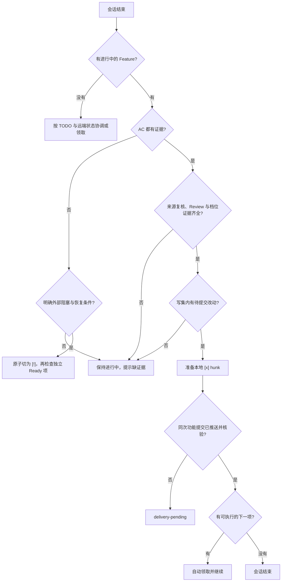

import { Aside } from '@astrojs/starlight/components'

## 这个 Hook 帮你做什么

主 Agent 一轮会话结束时，Stop Hook 会自动做四件事，你不需要手工维护 TODO 勾选：

| 行为 | 你会看到的现象 |
|------|--------------|
| 检查完成条件 | 条件不足时，TODO 里的 Feature 仍是进行中状态，并给出缺什么 |
| 更新 TODO | 条件满足时，在首次 commit 前准备 Feature 的 `[x]` hunk |
| 核验远端 | 代码没推到远端时，标记为 `delivery-pending`，不往下走 |
| 接着做下一项 | 有可执行的下一个 Feature 时自动领取并继续 |

<Aside type="note">
主 Agent 结束走 Stop，Subagent 结束走 [SubagentStop Hook](/skills/hooks/subagent-stop/)。已领取 Feature 的 SubagentStop 分支检查交接，由主 Agent 完成 Git 收口；共享脚本在没有当前项时仍可能协调或领取状态。
</Aside>

`git commit` 和 `git push` 由主 Agent 在已有授权内执行。Stop Hook 负责状态和远端核验，不会自动提交或推送。

## 什么时候会触发

客户端发出 `Stop` 事件时触发。强制退出、客户端崩溃或网络中断不保证发出该事件；恢复会话后应重新读取 TODO 与 Git 事实。

## 会检查哪些完成条件

完成前先按 [update-status](/skills/skills-reference/medium/update-status/) 组装一次完整摘要，原样写入当前 Feature 的单行 `结果`。Hook 再核对全部 AC、来源复核、Review、验证与风险档位，以及实例、写集和真实改动。不能等 Hook 逐项报错后再补字段。



### 1. 每个 AC 都有证据

稳定验收写在 `验收` 字段下，实际证据集中写进同一条 `结果`。解析器不会把独立的 `AC-001:` 或 `Review:` 行当成完成摘要。下面展示完成前的 Feature 结构；路径、实例和证据都是示例，使用时必须来自当前项目的真实事实：

```markdown
- [~] `USER-LOGIN` 【菜单:/login】用户登录
  - Owner：`alice-chen`
  - 执行实例：`session-abc123`
  - 来源锚点：`docs/PRD.md#login`、`PROJECT-MEMORY.md#boundaries`；用户结果：登录后进入首页；技术结论：复用已批准认证方案
  - 规划：Standard + Build
  - 验证：Regression-required
  - 目标：完成真实登录与错误反馈
  - 依赖：无
  - 并行写集：`src/api/user/login.ts`、`src/pages/login.vue`、`CHANGELOG.md`
  - 交付面：API、页面、认证、异常恢复、验证与 Review
  - 验收：
    - AC-001：合法账号登录后进入首页
    - AC-002：错误密码显示反馈且不建立会话
  - 结果：来源复核：docs/PRD.md#login、PROJECT-MEMORY.md#boundaries -> 与锚点一致; AC-001 -> 真实页面登录后进入首页并核对响应; AC-002 -> 错误密码未建立会话且页面反馈正确; baseline: 修复前错误密码进入首页; fixed: 修复后同条件被拒绝; Review: pass
```

常见的证据写法：

| 证据类型 | 写法示例 | 适用场景 |
|---------|---------|---------|
| 手工测试 | `手工测试通过` | 功能验证 |
| 单元测试 | `单元测试通过 (UserLoginTest)` | 代码逻辑 |
| DevTools | `DevTools 验证` | 前端调试 |
| 截图 | `截图确认` | UI 验证 |
| 日志 | `日志输出正确` | 后端验证 |
| Postman | `Postman 测试通过` | API 验证 |

<Aside type="caution">
未验证项使用 `AC-xxx -> unverified: <原因/恢复条件>`，不能改成空泛的“通过”。所有稳定 AC 都必须在 `结果` 中有匹配等级的新鲜证据，且完成摘要不能包含 `unverified`。
</Aside>

### 外部阻塞要标成 `[!]`

证据不足时不能删除 `unverified`，也不能为了让 Hook 通过而调用 `--complete`。如果缺口来自真实的账号、设备、审批或外部系统，并且当前回合已经没有可执行的实现，结果摘要要同时写明原因和恢复条件：

```text
  - 结果：AC-001 -> unverified: 缺少真实 Desktop 会话和审批数据; 外部阻塞：设备会话与审批数据未就绪; 恢复条件：提供测试会话、审批数据及实际操作所需授权
```

Stop Hook 识别这两个明确字段后，会在锁内把当前实例拥有的 `[~]` 原子切换为 `[!]`，保留最后执行实例；依赖它的 Feature 不会被领取。若仍有可执行的实现，保持 `[~]` 继续当前 Feature。恢复外部条件后，由主 Agent 通过状态机恢复并重新核验，而不是手工改 checkbox。

### 2. 来源复核与 Review 齐全

所有档位的同一条 `结果` 都需要 `来源复核：<原始章节> -> <与锚点一致/变化已复核>`，以及 `Review: pass` 或 `Review：通过`。来源复核要实际回读当前 Feature 的来源锚点与相关项目记忆，Review 要对应本次完整 diff。

| 状态 | 能否完成 |
|------|---------|
| `pending` | 否 |
| `in-progress` | 否 |
| `fail` | 否 |
| `pass` | 仅满足 Review 条件，仍需其余完成证据 |

每个完整 diff 使用一次 `code-review` 作为问题发现入口；自动化检查结果可以作为证据，不能单独替代完整 Review。

### 3. 写集内有真实改动

只改 TODO 勾选或只写证明文档，不算完成。必须有写集里声明的业务文件发生变化：

```markdown
- [~] `USER-LOGIN` 用户登录
  - 并行写集：`src/api/user/login.ts`、`src/pages/login.vue`、`CHANGELOG.md`
```

自己确认一下：

```bash
git diff --name-only
git diff --cached --name-only
```

输出里要有当前功能写集内的真实改动。只改 TODO 或证明文档不构成完成；文档本身是已批准交付物时，应按该文档任务的验收判断。

<Aside type="note">
TODO 文件的改动会跟着业务代码一起提交，但它本身不构成完成依据。
</Aside>

### 4. 满足档位声明的要求

规划档位和验证档位属于当前 Feature，分别写在 `规划` 与 `验证` 字段；不使用 TODO 头部的独立 `档位` / `自主模式` 代替：

```markdown
  - 规划：Standard + Build
  - 验证：Regression-required
```

| 验证档位 | 同一条 `结果` 额外包含 |
|------|---------|
| Evidence-only | 来源复核、全部 AC 证据与 Review；证据可来自源码、已有检查和适用真实主路径 |
| Test-first | 上述内容，加 `RED: <修复前证据>` 与 `GREEN: <修复后证据>` |
| Regression-required | 上述内容，加 `baseline: <修复前证据>` 与 `fixed: <修复后证据>` |

规划档位为 `High-risk` 时必须使用 `Regression-required`，并在同一条 `结果` 补齐风险、回滚、方案复核与发布检查。以下仅展示该 Feature 的相关字段，其他声明仍按前面的完整结构保留：

```markdown
  - 规划：High-risk + Build
  - 验证：Regression-required
  - 结果：来源复核：<迁移方案章节> -> 与锚点一致; AC-001 -> <迁移后真实数据证据>; baseline: <迁移前基线>; fixed: <迁移后同条件证据>; Risk: <数据与兼容边界>; Rollback: <已核对的回滚方式>; Plan review: pass; Release check: pass; Review: pass
```

发布检查确实不适用时可写 `Release check: not-applicable` 并说明原因；没有执行不能写成 `pass`。这几行只说明解析格式，不能代替真实迁移、回滚或发布证据。档位不会自动授权新增测试源码；只有用户本轮明确要求时才新增或修改测试。

## 远端核验与 delivery-pending

Feature 在本地准备为 `[x]` 后，Stop Hook 核对该状态和业务改动是否已进入同一个功能提交，并核验 HEAD、upstream 与 remote。未通过时输出 `delivery-pending`；它是检查结果，不是另一种 checkbox，也不应手工追加成 TODO 状态字段。

这个状态下会发生什么：

- 依赖它的后续 Feature 不会被认为可执行
- 不会再领取新的并行 Feature
- 不会自动续作

主 Agent 将待交付功能和 TODO hunk 同次提交推送后，下一轮 Stop Hook 会重新核验：

```bash
git push "<remote>" "<current-branch>"
```

<Aside type="caution">
push 失败要先解决冲突再重推，卡在 `delivery-pending` 会阻塞后面所有任务。
</Aside>

## 自动续作

四个条件同时满足才会自动接着做下一项：

1. 当前 Feature 已标记完成
2. 远端核验通过，不是 `delivery-pending`
3. 存在可执行的下一个 Feature：依赖都已完成，写集与其他进行中的 Feature 不冲突
4. 已有继续实施授权，当前实例没有其他 `[~]`，没有共享迁移、配置、契约、端口或账号资源

Codex 下自动续作时会再触发一次 Stop 检查，这是正常现象，不代表任务出错。

## Git 交付流程

Stop Hook 或状态机命令准备完 TODO 的 `[x]` 后，由主 Agent 在已有授权内精确提交。以下是单个功能的示意，实际文件、远端和分支以当前仓库为准：

```bash
# 1. 精确暂存写集内的文件
git add src/api/user/login.ts src/pages/login.vue

# 2. 一起暂存 TODO 文件
git add docs/alice-chen/tasks/todo/user-mgmt.md

# 3. 一起暂存本次真实变更的日志
git add CHANGELOG.md

# 4. 功能、TODO 与日志同次提交
git commit -m "feat: implement user login

- Add login API endpoint
- Add login page
- Update router

AC-001: 用户可以登录 -> 手工测试通过
AC-002: Token 存储 -> DevTools 验证
Review: pass"

# 5. 推送
git push "<remote>" "<current-branch>"
```

Commit message 的结构：

```
<type>: <subject>

<body>

<evidence>
```

完成结果必须先写入 TODO 的单行 `结果`，包含来源复核、每条 AC 的真实证据、`Review: pass` 以及当前验证与风险档位要求。显式调用 `--complete --result` 时，传入与该行完全相同的摘要。提交说明可以保留必要摘要，但不能替代 TODO 完成摘要或远端 OID 核验。

## 与 SubagentStop 的分工

| 行为 | Stop Hook | SubagentStop Hook |
|------|-----------|-------------------|
| 触发对象 | 主 Agent | Subagent |
| 更新 TODO | 是 | 已领取项走交接；无当前项时共享脚本仍可能协调状态 |
| commit & push | 否，由主 Agent 执行 | 否，交回主 Agent |
| 远端核验 | 是 | 否 |
| 自动续作 | 是 | 否 |
| 要求 Handoff 契约 | 否 | 是 |

Subagent 结束后，主 Agent 会对账实际 diff 与写集、执行 Review、补齐 AC 证据，然后才走 Stop Hook 的完成流程。

## 故障排查

### Feature 一直标不上完成

**现象**：会话结束了，TODO 里还是进行中，提示缺少证据。

**处理**：

先读取当前 Feature 的 `验收`、`来源锚点`、`规划`、`验证`、`并行写集` 和单行 `结果`。由 `update-status` 按已有真实证据一次性组装完整摘要，再通过状态机收口；不要只在验收条目后补“通过”，也不要手工改 checkbox。

`结果` 缺失、AC 未全部映射、缺来源复核、Review 未通过、档位字段不全或没有待提交改动，都会阻止完成。核对范围应包含 staged 和 unstaged 改动。

如果缺口是账号、设备、审批或外部系统没有就绪，不要补写虚假的证据。把结果摘要写成 `外部阻塞：<原因>；恢复条件：<条件>`，让 Stop Hook 把 `[~]` 切为 `[!]`；仍可继续实现时保持 `[~]`。

### 卡在 delivery-pending

**现象**：Feature 已完成但状态是 `delivery-pending`，后续任务不动。

**处理**：

```bash
# 确认远端有没有这些提交
git log origin/main --oneline -10

# 推上去
git push origin main
```

下一轮 Stop Hook 会自动重新核验并续作。

### 没有自动接着做下一项

**现象**：一个 Feature 完成后会话就结束了，没有领取下一项。

按顺序排查：

```bash
# 1. 确认已推到远端，不是 delivery-pending
git log origin/main --oneline -3

# 2. 打开 TODO，看下一个 Feature 的依赖是否全部已完成
cat docs/alice-chen/tasks/todo/project.md

# 3. 看是否有其他进行中的 Feature 与它写集重叠
```

依赖没满足就先做依赖项；写集冲突就等冲突任务结束，或调整写集边界让两者互不重叠。

### 提示执行实例不匹配

**现象**：报错说当前实例和 Feature 上记录的实例不是同一个。

**原因**：这个 Feature 已经被另一个 runtime instance 领取。一个 Feature 同时只允许一个 Owner；状态切换通过锁串行完成，不同实例可以按互斥写集并行处理不同 Feature。

**处理**：先确认旧实例确实已经停止，再让主 Agent 重新分配这个 Feature。旧实例还在跑的时候不要强行接管，会导致两边写同一批文件。

## 环境变量

```bash
# 自定义实例 ID（仅在客户端未提供时生效）
export AGENT_RUNTIME_INSTANCE_ID=worker-a
```

`AGENT_RUNTIME_HOOKS_DISABLED=1` 不会关闭本页的 TODO 状态逻辑。停用客户端事件前应先核对托管配置，见 [安装指南](/skills/hooks/installation/)。

## 下一步

- [SubagentStop Hook](/skills/hooks/subagent-stop/) - Subagent 交接
- [TODO 管理](/skills/usage/todo-management/) - TODO 使用指南
- [Git 工作流](/skills/usage/git-workflow/) - Git 操作指南
- [故障排查](/skills/hooks/troubleshooting/) - 更多常见问题
