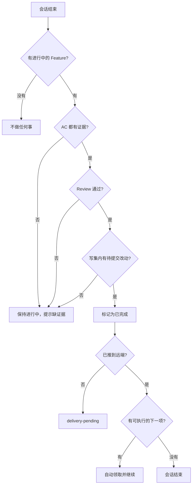

import { Aside } from '@astrojs/starlight/components'

## 这个 Hook 帮你做什么

主 Agent 一轮会话结束时，Stop Hook 会自动做四件事，你不需要手工维护 TODO 勾选：

| 行为 | 你会看到的现象 |
|------|--------------|
| 检查完成条件 | 条件不足时，TODO 里的 Feature 仍是进行中状态，并给出缺什么 |
| 更新 TODO | 条件满足时，Feature 自动从进行中变为已完成 |
| 核验远端 | 代码没推到远端时，标记为 `delivery-pending`，不往下走 |
| 接着做下一项 | 有可执行的下一个 Feature 时自动领取并继续 |

<Aside type="note">
Stop Hook 只对主 Agent 生效。Subagent 结束走 [SubagentStop Hook](/skills/hooks/subagent-stop/)，它不改 TODO、不提交代码。
</Aside>

## 什么时候会触发

- 你主动结束会话
- Agent 判断当前任务已经做完
- 会话超时或被中断

## 会检查哪些完成条件

四项都满足，Feature 才会被标记完成。



### 1. 每个 AC 都有证据

TODO 里每条验收条件后面必须写明怎么验的，`?` 表示还没验：

```markdown
- [~] `USER-LOGIN` 用户登录
  - AC-001: 用户可以登录 -> 手工测试通过
  - AC-002: Token 存储 -> DevTools 验证
  - AC-003: 错误提示 -> 截图确认
```

常见的证据写法：

| 证据类型 | 写法示例 | 适用场景 |
|---------|---------|---------|
| 手工测试 | `手工测试通过` | 功能验证 |
| 单元测试 | `单元测试通过 (UserLoginTest)` | 代码逻辑 |
| DevTools | `DevTools 验证` | 前端调试 |
| 截图 | `截图确认` | UI 验证 |
| 日志 | `日志输出正确` | 后端验证 |
| Postman | `Postman 测试通过` | API 验证 |

<Aside type="caution">
只要还有 `AC-xxx -> ?`，Feature 就不会被标记完成。
</Aside>

### 2. Review 结果为 pass

```markdown
- [~] `USER-LOGIN` 用户登录
  - Review: pass
```

| 状态 | 能否完成 |
|------|---------|
| `pending` | 否 |
| `in-progress` | 否 |
| `fail` | 否 |
| `pass` | 是 |

Review 结果可以来自 `code-review` Skill、团队成员的人工 Review，或自动化检查工具。

### 3. 写集内有真实改动

只改 TODO 勾选或只写证明文档，不算完成。必须有写集里声明的业务文件发生变化：

```markdown
- [~] `USER-LOGIN` 用户登录
  - 写集: src/api/user/login.ts, src/pages/login.vue
```

自己确认一下：

```bash
git diff --name-only
```

输出里要能看到写集内的文件，只有 TODO 文件或文档变化时不满足条件。

<Aside type="note">
TODO 文件的改动会跟着业务代码一起提交，但它本身不构成完成依据。
</Aside>

### 4. 满足档位声明的要求

TODO 头部声明的档位决定检查强度：

```markdown
## 规划与自主模式

档位: Standard
自主模式: Build
```

| 档位 | 额外要求 |
|------|---------|
| Lite | AC 证据 + Review |
| Standard | AC 证据 + Review + 基本测试 |
| High-risk | AC 证据 + Review + 回滚方案 + 发布检查 |

High-risk 的 Feature 需要在 TODO 里补齐这几行：

```markdown
- [~] `DATABASE-MIGRATION` 数据库迁移
  - 档位: High-risk
  - 风险边界: 影响生产数据
  - 回滚方案: 保留旧表 users_backup
  - 方案复核: 已与 DBA 确认
  - 发布检查: 灰度发布，先 10% 流量
```

## 远端核验与 delivery-pending

Feature 标记完成后，Stop Hook 会确认改动是否已经推到远端。没推的话状态是 `delivery-pending`：

```markdown
- [x] `USER-LOGIN` 用户登录
  - 状态: delivery-pending
```

这个状态下会发生什么：

- 依赖它的后续 Feature 不会被认为可执行
- 不会再领取新的并行 Feature
- 不会自动续作

推上去就能解除，下一轮 Stop Hook 会重新核验：

```bash
git push origin main
```

<Aside type="caution">
push 失败要先解决冲突再重推，卡在 `delivery-pending` 会阻塞后面所有任务。
</Aside>

## 自动续作

四个条件同时满足才会自动接着做下一项：

1. 当前 Feature 已标记完成
2. 远端核验通过，不是 `delivery-pending`
3. 存在可执行的下一个 Feature：依赖都已完成，写集与其他进行中的 Feature 不冲突
4. 当前会话没有被终止

Codex 下自动续作时会再触发一次 Stop 检查，这是正常现象，不代表任务出错。

## Git 交付流程

Stop Hook 更新完 TODO 后，提交按下面的顺序走：

```bash
# 1. 精确暂存写集内的文件
git add src/api/user/login.ts src/pages/login.vue

# 2. 一起暂存 TODO 文件
git add docs/alice-chen/tasks/todo/user-mgmt.md

# 3. 提交，把验收证据写进 commit message
git commit -m "feat: implement user login

- Add login API endpoint
- Add login page
- Update router

AC-001: 用户可以登录 -> 手工测试通过
AC-002: Token 存储 -> DevTools 验证
Review: pass"

# 4. 推送
git push origin main
```

Commit message 的结构：

```
<type>: <subject>

<body>

<evidence>
```

`<evidence>` 部分放 AC 证据和 Review 结果，下一轮核验和后续追溯都靠它。

## 与 SubagentStop 的分工

| 行为 | Stop Hook | SubagentStop Hook |
|------|-----------|-------------------|
| 触发对象 | 主 Agent | Subagent |
| 更新 TODO | 是 | 否 |
| commit & push | 是 | 否，交回主 Agent |
| 远端核验 | 是 | 否 |
| 自动续作 | 是 | 否 |
| 要求 Handoff 契约 | 否 | 是 |

Subagent 结束后，主 Agent 会对账实际 diff 与写集、执行 Review、补齐 AC 证据，然后才走 Stop Hook 的完成流程。

## 故障排查

### Feature 一直标不上完成

**现象**：会话结束了，TODO 里还是进行中，提示缺少证据。

**处理**：

```bash
# 1. 打开自己的 TODO
cat docs/alice-chen/tasks/todo/project.md

# 2. 把 AC-001: 用户可以登录 -> ?
#    补成 AC-001: 用户可以登录 -> 手工测试通过

# 3. 告诉 Agent 重新收口
```

同样先确认 `Review: pass` 已经写上，以及写集内确实有改动。

### 卡在 delivery-pending

**现象**：Feature 已完成但状态是 `delivery-pending`，后续任务不动。

**处理**：

```bash
# 确认远端有没有这些提交
git log origin/main --oneline -10

# 推上去
git push origin main
```

下一轮 Stop Hook 会自动重新核验并续作。

### 没有自动接着做下一项

**现象**：一个 Feature 完成后会话就结束了，没有领取下一项。

按顺序排查：

```bash
# 1. 确认已推到远端，不是 delivery-pending
git log origin/main --oneline -3

# 2. 打开 TODO，看下一个 Feature 的依赖是否全部已完成
cat docs/alice-chen/tasks/todo/project.md

# 3. 看是否有其他进行中的 Feature 与它写集重叠
```

依赖没满足就先做依赖项；写集冲突就等冲突任务结束，或调整写集边界让两者互不重叠。

### 提示执行实例不匹配

**现象**：报错说当前实例和 Feature 上记录的实例不是同一个。

**原因**：这个 Feature 已经被另一个 Agent 实例领取了。同一时刻只允许一个实例更新 TODO，这是防止并发写坏文件的保护。

**处理**：先确认旧实例确实已经停止，再让主 Agent 重新分配这个 Feature。旧实例还在跑的时候不要强行接管，会导致两边写同一批文件。

## 环境变量

```bash
# 跳过部分 Hook
export AGENT_RUNTIME_HOOKS_DISABLED=1

# 自定义实例 ID（仅在客户端未提供时生效）
export AGENT_RUNTIME_INSTANCE_ID=worker-a

# 仓库 ID 到本地 checkout 的映射
export AGENT_REPO_ROOTS='{"backend":"/checkout/backend"}'
```

## 下一步

- [SubagentStop Hook](/skills/hooks/subagent-stop/) - Subagent 交接
- [TODO 管理](/skills/usage/todo-management/) - TODO 使用指南
- [Git 工作流](/skills/usage/git-workflow/) - Git 操作指南
- [故障排查](/skills/hooks/troubleshooting/) - 更多常见问题
