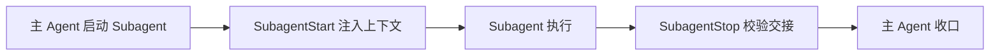

import { Aside } from '@astrojs/starlight/components'

## 这个 Hook 帮你做什么

主 Agent 每次启动 Subagent，SubagentStart Hook 都会给 Subagent 补一份精简上下文，内容和主 Agent 收到的一致：

- 开发行为原则
- 项目记忆里与当前任务相关的事实（技术栈、可复用工具、边界）
- 当前开发者的活动 TODO 提醒

上下文是按当前任务挑选的，不是把整个文件塞进去。

这些提示帮助 Subagent 核对技术栈与修改边界，但不能替代读取实际源码或检查 diff，也不是逐文件写入锁。

<Aside type="note">
主 Agent 的上下文由 [UserPromptSubmit Hook](/skills/hooks/user-prompt-submit/) 注入，两者读的是同一个项目记忆和同一份 TODO，所以内容一致。
</Aside>

## 什么时候会触发

每次启动 Subagent 都会触发，包括：

- 主 Agent 委派子任务
- 并行启动多个 Subagent
- Subagent 内部再启动更深一层的 Subagent

具体是否触发取决于客户端是否为该次委派发出 SubagentStart 事件，主 Agent 仍应明确传递任务边界。



## 注入了什么

### 行为原则

约束 Subagent 的开发方式：事实先行、简单优先、最小写集、以可观察结果判断完成、按需加载 Skill、边界明确时直接推进。

### 项目事实

从项目记忆里取当前任务用得上的部分，例如：

```markdown
技术栈: Vue 3 + Spring Boot
可复用: API 请求工具 src/utils/request.ts
边界: UI 组件只使用 Element Plus
```

### TODO 提醒

当前实例拥有的 Feature 标识与 TODO 路径，并提示回读相关写集、验收与阶段。没有已领取项时，不保证存在完整任务上下文。

## 为什么 Subagent 需要这个

### 委派子任务时

主 Agent 把前端页面交给 Subagent 时，应明确真实框架、可复用组件、页面/API 契约和互斥写集，并让子 Agent 回读对应源码。

### 并行执行时

同时跑多个 Subagent，每个都收到相同的行为原则和项目事实，但各自的 TODO 提醒对应自己那个 Feature，写集互不重叠。

### 不继承对话的 Subagent

对话是否继承由客户端和委派工具参数决定，不由本 Hook 保证。使用前按当前 Harness 的工具说明核对。

<Aside type="caution">
不继承对话的子 Agent 更需要完整的任务说明。主 Agent 应显式传递目标、已确认边界、写集、验收和必要来源，不能只依赖 Hook 摘要。
</Aside>

## 委派时的写法建议

Hook 注入的是项目级上下文，任务级的边界还是要在委派时写清楚。

明确到文件和验收条件：

```text
实现用户注册页面 (src/pages/register.vue)

要求：
- 使用 Element Plus Form 组件
- 包含邮箱、密码、确认密码字段，带表单验证
- 调用 POST /api/v1/auth/register

写集：
- src/pages/register.vue
- src/router/index.ts
不要修改其他文件。

验收条件：
- AC-001: 用户可以提交注册表单
- AC-002: 邮箱格式错误时有明确提示
完成后提供验证证据。
```

避免这种没有边界的委派：

```text
实现用户管理的所有前端功能
```

## Subagent 结束后主 Agent 要做什么

Subagent 停止时会通过 [SubagentStop Hook](/skills/hooks/subagent-stop/) 交出一份 Handoff，主 Agent 拿到后：

1. 对账实际 diff 与 TODO 里声明的写集
2. 执行 code-review
3. 补齐 AC 证据
4. 走 [Stop Hook](/skills/hooks/stop/) 的完成流程

## 故障排查

### Subagent 不知道项目技术栈

**现象**：Subagent 引入了项目里没用过的库，或者假设了错误的框架。

**诊断**：

```bash
# 1. 确认 Hook 已安装
node "<skills-root>/runtime-hooks/scripts/install.mjs" --check --json

# 2. 确认项目记忆存在且不为空
ls PROJECT-MEMORY.md
```

**处理**：

```bash
# Hook 没装就装一次
node "<skills-root>/runtime-hooks/scripts/install.mjs"
```

Codex 需要额外信任一次 Hook：

```bash
codex
/hooks trust all
```

项目记忆缺失或为空时，让 Agent 先初始化项目记忆，再重新委派。

### Subagent 行为和主 Agent 不一致

**现象**：两边对项目的认知不同。

**原因**：可能不在同一个 Git 仓库，或开发者身份不同，导致读到不同的项目记忆和 TODO。

**诊断**：

```bash
git rev-parse --show-toplevel
git config user.name
find docs/ -path "*/tasks/todo/*.md"
```

确认主 Agent 和 Subagent 在同一个仓库、同一个开发者身份下运行。

### Subagent 改了写集外的文件

**现象**：diff 里出现不该动的文件。

**处理**：

```bash
# 1. 确认 PreToolUse Hook 已安装
node "<skills-root>/runtime-hooks/scripts/install.mjs" --check
```

主 Agent 收口时对账写集，拒绝写集外的改动。如果确实需要扩大范围，先更新 TODO 里的写集声明，而不是默认接受。

## 环境变量

```bash
# 自定义开发者 ID（仅在 Git 和系统登录用户名都不可用时兜底）
export AGENT_DEVELOPER_NAME=alice-chen

# 启用 Skill 发现兜底（旧客户端）
export AGENT_SKILL_DISCOVERY_FALLBACK=1
```

`AGENT_RUNTIME_HOOKS_DISABLED=1` 不会关闭本页的上下文脚本。

## 下一步

- [SubagentStop Hook](/skills/hooks/subagent-stop/) - Subagent 停止和交接
- [UserPromptSubmit Hook](/skills/hooks/user-prompt-submit/) - 主 Agent 的上下文注入
- [Stop Hook](/skills/hooks/stop/) - 主 Agent 完成和续作
- [最佳实践](/skills/best-practices/) - 更多使用技巧
