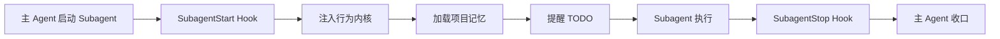
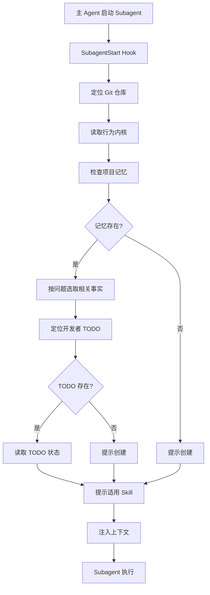
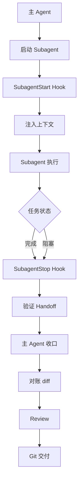

import { Aside } from '@astrojs/starlight/components'

## 概述

SubagentStart Hook 在 Subagent 启动时触发，与 UserPromptSubmit Hook 共享相同的逻辑，负责为 Subagent 注入行为内核、项目记忆和 TODO 提醒，确保 Subagent 有完整的上下文。

**关键职责**：
- **行为内核注入**：与主 Agent 相同的开发原则
- **项目记忆加载**：与主 Agent 相同的事实摘要
- **TODO 提醒**：当前开发者的活动任务
- **上下文同步**：确保 Subagent 与主 Agent 一致

## 触发时机



**每次 Subagent 启动时触发**，包括：
- 主 Agent 调用 `Agent` 工具
- 主 Agent 委派子任务
- 并行执行多个 Subagent

## 与 UserPromptSubmit 的关系

SubagentStart Hook 与 UserPromptSubmit Hook 使用**完全相同的实现**：

```javascript
// 两个 Hook 都调用同一个函数
const { injectContext } = require('./skill-catalog-context.cjs');

// UserPromptSubmit Hook
module.exports.handleUserPromptSubmit = function(input) {
  return injectContext(input, 'UserPromptSubmit');
};

// SubagentStart Hook
module.exports.handleSubagentStart = function(input) {
  return injectContext(input, 'SubagentStart');
};
```

### 注入内容完全相同

| 内容 | UserPromptSubmit | SubagentStart | 预算 |
|------|-----------------|---------------|------|
| 行为内核 | ✅ | ✅ | 1500 bytes |
| 项目记忆 | ✅ | ✅ | 3000 bytes |
| TODO 提醒 | ✅ | ✅ | 2000 bytes |
| Skill 提示 | ✅ | ✅ | - |
| **总计** | **8000 bytes** | **8000 bytes** | **8000 bytes** |

<Aside type="note">
两个 Hook 注入的内容完全一致，确保主 Agent 和 Subagent 有相同的行为原则和项目上下文。
</Aside>

## 为什么需要 SubagentStart

### 场景 1：主 Agent 委派子任务

```javascript
// 主 Agent
"实现用户管理系统"

// 主 Agent 启动 Subagent 处理前端
Agent({
  description: "实现前端页面",
  prompt: "实现用户注册和登录页面",
  subagent_type: "fork"
});
```

**SubagentStart 注入**：
- ✅ 行为内核：事实先行、简单优先、最小写集等
- ✅ 项目记忆：技术栈 Vue 3、组件库 Element Plus
- ✅ TODO 提醒：当前 Feature USER-REG-PAGE，写集 src/pages/register.vue

**效果**：
- Subagent 知道项目使用 Vue 3，不会引入 React
- Subagent 知道只能修改 src/pages/register.vue
- Subagent 遵循最小写集原则

### 场景 2：并行执行多个 Subagent

```javascript
// 主 Agent 同时启动两个 Subagent
Agent({
  description: "实现后端 API",
  prompt: "实现用户注册 API"
});

Agent({
  description: "实现前端页面",
  prompt: "实现用户注册页面"
});
```

**SubagentStart 为每个 Subagent 注入**：
- ✅ 相同的行为内核
- ✅ 相同的项目记忆
- ✅ 各自的 TODO 提醒（不同 Feature）

**效果**：
- 两个 Subagent 遵循相同的开发原则
- 两个 Subagent 知道项目技术栈
- 两个 Subagent 修改不同的文件（写集互斥）

### 场景 3：深度任务分解

```javascript
// 主 Agent
"实现用户管理系统"

// 启动 Subagent 1
Agent({
  description: "产品定义",
  prompt: "完成用户管理系统的产品定义"
});

// Subagent 1 启动 Subagent 2
Agent({
  description: "UI 设计",
  prompt: "设计用户注册页面"
});
```

**SubagentStart 在每一层注入**：
- ✅ Subagent 1：行为内核 + 项目记忆 + TODO
- ✅ Subagent 2：行为内核 + 项目记忆 + TODO

**效果**：
- 所有层级的 Subagent 都有完整上下文
- 深层 Subagent 也知道项目技术栈和边界
- 不会因为层级深而丢失上下文

## 注入内容详解

### 1. 行为内核

与 UserPromptSubmit 完全相同：

```markdown
<behavior_kernel>
- 事实先行：先读取适用规则、仓库事实和已批准边界；信息不足时明确缺口，不猜测。
- 简单优先：选择满足目标的最简单方案，不为假设需求增加抽象、兼容层或流程。
- 最小写集：只修改目标直接需要的文件与行为，保留无关现状。
- 目标驱动：以可观察用户结果、验收和新鲜证据判断完成，不以文档、代码量或自报状态替代。
- 按需加载：Harness 原生提供 Skill 路由元数据；Hook 不重复注入清单，命中后再读取对应 SKILL.md 与必要 references。
- 有界推进：已授权且边界明确时直接执行；只有真实决策、越界或高风险不可逆动作才停门；委派必须有唯一 Owner 和互斥写集。
</behavior_kernel>
```

### 2. 项目记忆

与 UserPromptSubmit 完全相同：

```markdown
<project_memory path="docs/PROJECT-MEMORY.md">
Quick facts: 技术栈 Vue 3 + Spring Boot，认证方式 JWT
Reuse map: API 请求工具 src/utils/request.ts
Boundaries: UI 组件只使用 Element Plus
</project_memory>
```

### 3. TODO 提醒

与 UserPromptSubmit 完全相同：

```markdown
<active_todo path="docs/alice-chen/tasks/todo/user-mgmt.md">
当前 Feature: USER-LOGIN (用户登录)
状态: [~] 进行中
执行实例: agent-123
依赖: USER-REG [x]
写集: src/api/user/login.ts, src/pages/login.vue
AC-001: 用户可以登录 -> ?
AC-002: Token 存储 -> ?
Review: pending

下一个 Ready Feature: USER-PROFILE
</active_todo>
```

## 工作原理

### 执行流程



### 输入格式

SubagentStart Hook 通过 stdin 接收 JSON 输入：

```json
{
  "subagentPrompt": "实现用户注册页面",
  "parentContext": {
    "sessionId": "abc123",
    "agentId": "parent-agent-456"
  },
  "sessionContext": {
    "workingDirectory": "/project",
    "gitRoot": "/project",
    "subagentId": "subagent-789"
  }
}
```

### 输出格式

与 UserPromptSubmit 完全相同：

```json
{
  "systemMessage": "<behavior_kernel>...</behavior_kernel>\n<project_memory>...</project_memory>\n<active_todo>...</active_todo>\n<skill_hint>...</skill_hint>"
}
```

## 上下文继承

### 主 Agent 上下文

主 Agent 通过 UserPromptSubmit Hook 获得上下文：

```markdown
<behavior_kernel>...</behavior_kernel>
<project_memory>
技术栈: Vue 3 + Spring Boot
</project_memory>
<active_todo>
当前 Feature: USER-MGMT
</active_todo>
```

### Subagent 上下文

Subagent 通过 SubagentStart Hook 获得**相同的**上下文：

```markdown
<behavior_kernel>...</behavior_kernel>
<project_memory>
技术栈: Vue 3 + Spring Boot
</project_memory>
<active_todo>
当前 Feature: USER-MGMT
</active_todo>
```

### 上下文一致性保证

```javascript
function ensureContextConsistency(parentContext, subagentContext) {
  // 1. 行为内核：完全相同
  assert(subagentContext.behaviorKernel === parentContext.behaviorKernel);
  
  // 2. 项目记忆：完全相同（基于相同的 Git 仓库）
  assert(subagentContext.projectMemory.gitRoot === parentContext.projectMemory.gitRoot);
  
  // 3. TODO：完全相同（基于相同的开发者 ID）
  assert(subagentContext.todo.developerId === parentContext.todo.developerId);
}
```

<Aside type="tip">
主 Agent 和 Subagent 始终读取相同的项目记忆和 TODO 文件，确保上下文一致。
</Aside>

## Subagent 类型

### fork 类型

```javascript
Agent({
  subagent_type: "fork",
  description: "实现前端页面",
  prompt: "实现用户注册页面"
});
```

**特点**：
- 继承主 Agent 的完整对话上下文
- 继承主 Agent 的模型设置
- SubagentStart Hook 仍然注入行为内核和项目记忆

### 非 fork 类型

```javascript
Agent({
  description: "实现前端页面",
  prompt: "实现用户注册页面"
});
```

**特点**：
- 不继承主 Agent 的对话上下文
- 使用默认模型设置
- SubagentStart Hook 注入行为内核和项目记忆（**非常重要**）

<Aside type="caution">
非 fork Subagent 没有主 Agent 的对话历史，**必须**依赖 SubagentStart Hook 注入的上下文。
</Aside>

## 与 SubagentStop 的协作

### 完整生命周期



### Handoff 契约

Subagent 完成时，SubagentStop Hook 要求提供 Handoff 契约：

```json
{
  "feature": "USER-REG-PAGE",
  "instance": "subagent-789",
  "changedFiles": ["src/pages/register.vue", "src/router/index.ts"],
  "acCovered": ["AC-001", "AC-002"],
  "commands": ["npm run dev", "手工测试注册流程"],
  "decisions": ["使用 Element Plus Form 组件"],
  "unresolvedRisks": ["表单验证规则待完善"]
}
```

**主 Agent 收口**：
1. 对账 changedFiles 与写集
2. 执行 code-review
3. 补充 AC 证据
4. 调用 Stop Hook 完成

## 配置选项

### 环境变量

与 UserPromptSubmit 共享相同的环境变量：

```bash
# 禁用所有 Hook
export AGENT_RUNTIME_HOOKS_DISABLED=1

# 自定义开发者 ID（仅在 Git identity 不可用时）
export AGENT_DEVELOPER_NAME=alice-chen

# 启用 Skill 发现兜底（旧客户端）
export AGENT_SKILL_DISCOVERY_FALLBACK=1
```

### 调试模式

```bash
# 查看 SubagentStart 注入的内容
export AGENT_DEBUG=1
claude
```

## 故障排查

### Subagent 没有项目上下文

**症状**：Subagent 不知道项目技术栈，引入了错误的库。

**诊断**：

```bash
# 1. 检查 SubagentStart Hook 是否生效
node ~/.agent-workflow/skills/runtime-hooks/scripts/install.mjs --check --json

# 2. 检查项目记忆是否存在
ls docs/PROJECT-MEMORY.md

# 3. 手动测试 Hook
echo '{"subagentPrompt":"测试"}' | node ~/.agent-workflow/skills/runtime-hooks/scripts/skill-catalog-context.cjs
```

**解决方案**：

```bash
# 1. 确保 Hook 已安装
node ~/.agent-workflow/skills/runtime-hooks/scripts/install.mjs

# 2. Codex 用户需要信任 Hook
codex
/hooks trust all

# 3. 确保项目记忆存在
"初始化项目记忆"
```

### Subagent 上下文与主 Agent 不一致

**症状**：Subagent 的行为与主 Agent 不一致。

**原因**：可能读取了不同的项目记忆或 TODO。

**诊断**：

```bash
# 1. 检查 Git 仓库
pwd
git rev-parse --show-toplevel

# 2. 检查开发者 ID
git config user.name

# 3. 检查 TODO 路径
find docs/ -path "*/tasks/todo/*.md"
```

**解决方案**：

确保主 Agent 和 Subagent 在相同的 Git 仓库和开发者上下文中运行。

### Subagent 修改了写集外文件

**症状**：Subagent 修改了不应该修改的文件。

**原因**：PreToolUse Hook 的写集检查可能未生效，或 Subagent 没有收到 TODO 提醒。

**解决方案**：

```bash
# 1. 确保 PreToolUse Hook 已安装
node ~/.agent-workflow/skills/runtime-hooks/scripts/install.mjs --check

# 2. 主 Agent 收口时对账写集
# 拒绝 Subagent 的写集外改动

# 3. 更新 TODO 写集（如果确实需要）
vim docs/alice-chen/tasks/todo/project.md
```

## 最佳实践

### 1. 明确委派边界

```javascript
// ✅ 好的委派
Agent({
  description: "实现用户注册页面",
  prompt: `实现用户注册页面 (src/pages/register.vue)
要求：
- 使用 Element Plus Form 组件
- 包含邮箱、密码、确认密码字段
- 表单验证
- 调用 POST /api/v1/auth/register 接口
不要修改其他文件。`
});

// ❌ 不好的委派
Agent({
  description: "实现前端",
  prompt: "实现用户管理的所有前端功能"
});
```

### 2. 指定写集

```javascript
Agent({
  description: "实现后端 API",
  prompt: `实现用户登录 API
写集：
- src/main/java/controller/AuthController.java
- src/main/java/service/UserService.java
不要修改其他文件。`
});
```

### 3. 明确验收条件

```javascript
Agent({
  description: "实现用户登录",
  prompt: `实现用户登录功能
验收条件：
- AC-001: 用户可以通过邮箱和密码登录
- AC-002: 登录成功后返回 JWT token
- AC-003: 错误情况下返回清晰的错误信息
完成后提供证据。`
});
```

### 4. 主 Agent 收口

```javascript
// Subagent 完成后，主 Agent 必须：
// 1. 对账 diff
git diff --name-only

// 2. 检查写集
// 确保改动在写集内

// 3. code-review
"审查用户登录功能的代码"

// 4. 补充 AC 证据
// 5. 提交代码
"提交用户登录功能"
```

## 下一步

- [SubagentStop Hook](/skills/hooks/subagent-stop) - Subagent 停止和交接
- [UserPromptSubmit Hook](/skills/hooks/user-prompt-submit) - 详细的上下文注入机制
- [Stop Hook](/skills/hooks/stop) - 主 Agent 完成和续作
- [最佳实践](/skills/best-practices) - 更多使用技巧
