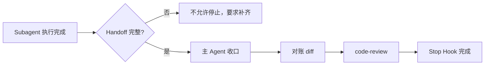

import { Aside } from '@astrojs/starlight/components'

## 这个 Hook 帮你做什么

Subagent 停止时，SubagentStop Hook 会检查它有没有交出一份完整的 Handoff。信息不全就不允许停止，Subagent 必须补齐后再结束。

这样做的目的是：主 Agent 不用去猜 Subagent 改了什么、验到什么程度、留了哪些坑。

它**不做**的事情：

- 不更新 TODO 状态，由主 Agent 的 [Stop Hook](/skills/hooks/stop/) 负责
- 不执行 commit & push，由主 Agent 负责
- 不核验远端，不自动续作



## 什么时候会触发

- Subagent 任务完成
- Subagent 遇到阻塞
- Subagent 部分完成后停止

三种情况都要交 Handoff，阻塞和部分完成也一样，只是内容不同。

## Handoff 要包含什么

| 字段 | 说明 | 示例 |
|------|------|------|
| Feature | Feature ID | `USER-LOGIN` |
| Instance | Subagent 实例 ID | `subagent-789` |
| Changed files | 实际修改的文件列表 | `src/api/user/login.ts, src/pages/login.vue` |
| AC covered | 覆盖的验收条件 | `AC-001, AC-002` |
| Commands/evidence | 验证命令或证据 | `npm run dev, 手工测试通过` |
| Decisions | 关键技术决策 | `使用 JWT 而非 Session` |
| Unresolved risks | 未解决的风险 | `Token 过期时间待定` |

<Aside type="caution">
缺任何一项都不能停止。缺失时 Hook 会直接说明差哪几个字段。
</Aside>

### 完整示例

````markdown
## Handoff to 主 Agent

**Feature**: USER-LOGIN

**Instance**: subagent-789

**Changed files**:
- src/api/user/login.ts (新增 login 方法)
- src/pages/login.vue (新增登录页面)
- src/router/index.ts (添加 /login 路由)

**AC covered**:
- AC-001: 用户可以登录
  → 实现了登录表单（邮箱 + 密码）
  → 实现了 POST /api/v1/auth/login 调用
  → 成功后跳转首页
- AC-002: Token 存储
  → Token 存储在 localStorage (key: "auth_token")
  → 已在 axios 拦截器中使用

**Commands/evidence**:
```bash
npm run dev
# 1. 访问 http://localhost:5173/login
# 2. 输入 test@example.com / password123
# 3. DevTools -> Application -> Local Storage 确认 auth_token 存在
# 4. 观察页面跳转到 /
```

**Decisions**:
- 使用 Element Plus Form 组件（项目已有，保持一致）
- Token 存储在 localStorage 而非 sessionStorage（支持"记住我"）

**Unresolved risks**:
- Token 过期时间待与后端对齐
- 刷新 token 机制未实现（需要后端支持）
- 登录失败重试限制未实现
````

## 三种停止场景怎么写

### 任务完成

按上面的完整示例写，AC 全部有对应实现说明，验证命令可执行。

### 遇到阻塞

已完成的部分照实写，未完成的 AC 明确标未实现，并说明阻塞在哪：

```markdown
**AC covered**:
- AC-001: 接收登录请求 -> 已实现
- AC-002: 验证密码 -> 未实现（等待确认加密方式）

**Commands/evidence**:
无（功能未完成）

**Unresolved risks**:
- 密码加密方式待用户确认（BCrypt vs Argon2）

**阻塞原因**: 等待用户确认密码加密方式
```

### 部分完成

哪些文件改到什么程度写清楚，别把未完成的写成完成：

```markdown
**Changed files**:
- src/pages/profile.vue (已实现展示)
- src/api/user.ts (已实现获取 API)
- src/pages/profile-edit.vue (未实现编辑)

**AC covered**:
- AC-001: 展示用户信息 -> 已实现
- AC-002: 编辑用户信息 -> 未实现
```

<Aside type="tip">
诚实写未解决的风险，主 Agent 才能判断要不要立刻处理。藏问题只会让它在收口或 Review 时才暴露。
</Aside>

## 主 Agent 收口流程

### 1. 对账 diff 与写集

```bash
git diff --name-only
```

把输出和 Handoff 里的 Changed files、TODO 里声明的写集三方比对。三者一致才继续。

### 2. 执行 code-review

```text
审查用户登录功能的代码
```

### 3. 补齐 AC 证据

按 Handoff 提供的验证命令实际跑一遍，把结果写回 TODO：

```markdown
- AC-001: 用户可以登录 -> 手工测试通过
- AC-002: Token 存储 -> DevTools 验证 localStorage
- Review: pass
```

### 4. 提交交付

```bash
git add src/api/user/login.ts src/pages/login.vue src/router/index.ts
git add docs/alice-chen/tasks/todo/user-mgmt.md
git commit -m "feat: implement user login"
git push origin main
```

## 与 Stop Hook 的分工

| 行为 | SubagentStop Hook | Stop Hook |
|------|------------------|-----------|
| 触发对象 | Subagent | 主 Agent |
| 更新 TODO | 否 | 是 |
| commit & push | 否 | 是 |
| 远端核验 | 否 | 是 |
| 自动续作 | 否 | 是 |
| 要求 Handoff | 是 | 否 |
| 检查完成门禁 | 否 | 是 |

## 故障排查

### Subagent 停不下来

**现象**：任务已经做完，但 Hook 一直要求补充。

**处理**：看提示里说缺哪几个字段，在最后一条回复中补齐完整 Handoff：

```markdown
## Handoff to 主 Agent

**Feature**: USER-LOGIN
**Instance**: subagent-789
**Changed files**: src/api/user/login.ts
**AC covered**: AC-001, AC-002
**Commands/evidence**: npm run dev, 手工测试
**Decisions**: 使用 JWT
**Unresolved risks**: Token 过期时间待定
```

七项都在才会通过。

### 主 Agent 不知道 Subagent 改了什么

**现象**：Subagent 停止了，但没有 Handoff。

**原因**：这个 Hook 大概率没生效。

**诊断**：

```bash
node <skills-root>/runtime-hooks/scripts/install.mjs --check --json
```

Claude Code 下还可以确认配置里有这个事件：

```bash
grep SubagentStop ~/.claude/settings.json
```

**处理**：

```bash
node <skills-root>/runtime-hooks/scripts/install.mjs
```

Codex 需要额外信任一次：

```bash
codex
/hooks trust all
```

### Handoff 和实际 diff 不符

**现象**：Handoff 声明只改了一个文件，`git diff --name-only` 里却多出几个。

**处理**：主 Agent 不要接受这种改动。要么让 Subagent 说明多出来的文件为什么必须改并更新 TODO 写集，要么回退重做。默认接受未声明的改动会让写集边界失效，并行任务随后就会互相踩。

## 环境变量

```bash
# 跳过部分 Hook
export AGENT_RUNTIME_HOOKS_DISABLED=1
```

<Aside type="caution">
跳过这个 Hook 后 Handoff 不再强制校验，主 Agent 很可能拿不到关键信息。
</Aside>

## 下一步

- [Stop Hook](/skills/hooks/stop/) - 主 Agent 完成和续作
- [SubagentStart Hook](/skills/hooks/subagent-start/) - Subagent 启动上下文
- [最佳实践](/skills/best-practices/) - Subagent 使用技巧
