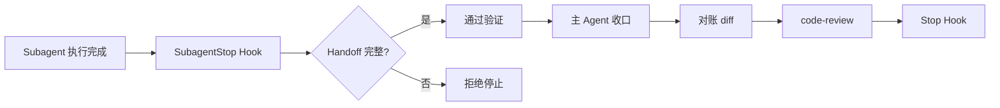
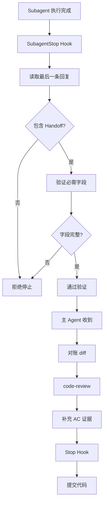

import { Aside } from '@astrojs/starlight/components'

## 概述

SubagentStop Hook 在 Subagent 停止时触发，负责验证 Handoff 契约的完整性，确保 Subagent 向主 Agent 提供足够的信息用于收口，但**不代替**主 Agent 的 Review 和 Git 操作。

**关键职责**：
- **Handoff 契约验证**：检查必要信息完整性
- **不更新 TODO**：状态更新由主 Agent 负责
- **不执行 Git**：commit & push 由主 Agent 负责
- **不续作任务**：自动续作由主 Agent 的 Stop Hook 负责

## 触发时机



**触发场景**：
- Subagent 任务完成
- Subagent 遇到阻塞
- Subagent 超时或异常退出

## Handoff 契约

### 必需字段

SubagentStop Hook 要求最后一条回复包含以下信息：

| 字段 | 说明 | 示例 |
|------|------|------|
| **Feature** | Feature ID | `USER-LOGIN` |
| **Instance** | Subagent 实例 ID | `subagent-789` |
| **Changed files** | 实际修改的文件列表 | `src/api/user/login.ts, src/pages/login.vue` |
| **AC covered** | 覆盖的验收条件 | `AC-001, AC-002` |
| **Commands/evidence** | 验证命令或证据 | `npm run dev, 手工测试通过` |
| **Decisions** | 关键技术决策 | `使用 JWT 而非 Session` |
| **Unresolved risks** | 未解决的风险 | `Token 过期时间待定` |

<Aside type="caution">
缺少任何必需字段，SubagentStop Hook 会拒绝停止，要求 Subagent 补充信息。
</Aside>

### 完整示例

```markdown
## Handoff to 主 Agent

**Feature**: USER-LOGIN

**Instance**: subagent-789

**Changed files**:
- src/api/user/login.ts
- src/pages/login.vue
- src/router/index.ts

**AC covered**:
- AC-001: 用户可以登录 -> 已实现登录表单和 API 调用
- AC-002: Token 存储 -> 已实现 localStorage 存储

**Commands/evidence**:
```bash
npm run dev
# 访问 http://localhost:5173/login
# 输入 test@example.com / password123
# 观察 DevTools localStorage
```

**Decisions**:
- 使用 Element Plus Form 组件
- 使用 axios 发送登录请求
- Token 存储在 localStorage（key: "auth_token"）

**Unresolved risks**:
- Token 过期时间待与后端对齐
- 刷新 token 机制待实现
- 密码强度验证规则待完善
```

## 验证逻辑

### 检查流程

```javascript
function validateHandoff(lastResponse) {
  const requiredFields = [
    'Feature',
    'Instance',
    'Changed files',
    'AC covered',
    'Commands',
    'Decisions',
    'Unresolved risks'
  ];
  
  const missingFields = [];
  
  for (const field of requiredFields) {
    const pattern = new RegExp(`\\*\\*${field}\\*\\*:`, 'i');
    if (!pattern.test(lastResponse)) {
      missingFields.push(field);
    }
  }
  
  if (missingFields.length > 0) {
    return {
      valid: false,
      reason: `Handoff 缺少必需字段: ${missingFields.join(', ')}`
    };
  }
  
  return { valid: true };
}
```

### 拒绝停止

如果 Handoff 不完整：

```
❌ SubagentStop 验证失败

缺少必需字段: Commands, Unresolved risks

请在最后回复中补充 Handoff 契约：

## Handoff to 主 Agent

**Feature**: <FEATURE-ID>
**Instance**: <INSTANCE-ID>
**Changed files**: <文件列表>
**AC covered**: <AC 列表>
**Commands/evidence**: <验证命令>
**Decisions**: <关键决策>
**Unresolved risks**: <未解决风险>
```

Subagent 需要重新输出完整的 Handoff 才能停止。

## 与 Stop Hook 的区别

| 特性 | SubagentStop Hook | Stop Hook |
|------|------------------|-----------|
| **触发对象** | Subagent | 主 Agent |
| **TODO 状态更新** | ❌ 不更新 | ✅ 更新 `[~]` → `[x]` |
| **Git 操作** | ❌ 不执行 | ✅ commit & push |
| **远端核验** | ❌ 不核验 | ✅ 核验远端状态 |
| **自动续作** | ❌ 不续作 | ✅ 领取下一任务 |
| **Handoff 契约** | ✅ 必须提供 | ❌ 不需要 |
| **完成门禁** | ❌ 不检查 | ✅ 检查 AC + Review |

<Aside type="note">
SubagentStop 只验证 Handoff 完整性，所有实质性工作由主 Agent 负责。
</Aside>

## 主 Agent 收口流程

### 1. 接收 Handoff

```javascript
// Subagent 完成后，主 Agent 收到 Handoff
const handoff = {
  feature: "USER-LOGIN",
  instance: "subagent-789",
  changedFiles: ["src/api/user/login.ts", "src/pages/login.vue"],
  acCovered: ["AC-001", "AC-002"],
  commands: ["npm run dev", "手工测试通过"],
  decisions: ["使用 JWT 而非 Session"],
  unresolvedRisks: ["Token 过期时间待定"]
};
```

### 2. 对账 diff 和写集

```bash
# 主 Agent 检查实际改动
git diff --name-only

# 输出
src/api/user/login.ts
src/pages/login.vue
src/router/index.ts  # Handoff 已声明
docs/design.md       # 规划文档，允许

# 对比写集
# TODO 中声明的写集
写集: src/api/user/login.ts, src/pages/login.vue, src/router/index.ts

# 结论：改动在写集内 ✓
```

### 3. 执行 code-review

```bash
# 主 Agent 调用 code-review Skill
"审查用户登录功能的代码"

# Review 结果
Review: pass
发现问题: 无
建议: Token 过期时间建议设为 7 天
```

### 4. 补充 AC 证据

```bash
# 主 Agent 根据 Handoff 的 commands 补充证据
"USER-LOGIN 功能已验证：
- AC-001: 用户可以登录 -> 手工测试通过
- AC-002: Token 存储 -> DevTools 验证 localStorage
- Review: pass"
```

### 5. 调用 Stop Hook 完成

```bash
# 主 Agent 调用 Stop Hook
# Stop Hook 检查完成门禁
# 原子更新 [~] → [x]

# 主 Agent 提交代码
git add src/api/user/login.ts src/pages/login.vue src/router/index.ts
git add docs/alice-chen/tasks/todo/user-mgmt.md
git commit -m "feat: implement user login"
git push origin main
```

## Handoff 最佳实践

### 1. 明确改动范围

```markdown
**Changed files**:
- src/api/user/login.ts (新增 login 方法)
- src/pages/login.vue (新增登录页面)
- src/router/index.ts (添加 /login 路由)
```

### 2. 详细的 AC 覆盖

```markdown
**AC covered**:
- AC-001: 用户可以登录
  → 实现了登录表单（邮箱 + 密码）
  → 实现了 POST /api/v1/auth/login 调用
  → 实现了成功后跳转到首页
  
- AC-002: Token 存储
  → Token 存储在 localStorage (key: "auth_token")
  → 已在 axios 拦截器中使用
```

### 3. 可执行的验证命令

```markdown
**Commands/evidence**:
```bash
# 启动开发服务器
npm run dev

# 手工测试步骤
1. 访问 http://localhost:5173/login
2. 输入 test@example.com / password123
3. 点击登录按钮
4. 打开 DevTools -> Application -> Local Storage
5. 确认 auth_token 存在
6. 观察页面跳转到 /
```
```

### 4. 清晰的技术决策

```markdown
**Decisions**:
- 使用 Element Plus Form 组件（而非自定义表单）
  理由: 项目已有 Element Plus，保持一致性
  
- Token 存储在 localStorage（而非 sessionStorage）
  理由: 支持"记住我"功能
  
- 密码明文传输（HTTPS 加密）
  理由: 后端负责加密存储
```

### 5. 诚实的未解决风险

```markdown
**Unresolved risks**:
- Token 过期时间未定，默认使用 7 天（待与后端对齐）
- 刷新 token 机制未实现（需要后端支持）
- 密码强度验证规则待完善（当前只检查非空）
- 登录失败后的重试限制未实现（防暴力破解）
```

<Aside type="tip">
诚实汇报未解决的风险，方便主 Agent 评估是否需要立即处理。
</Aside>

## 常见场景

### 场景 1：Subagent 完成功能

```markdown
## Handoff to 主 Agent

**Feature**: USER-REG-PAGE

**Instance**: subagent-123

**Changed files**:
- src/pages/register.vue
- src/router/index.ts

**AC covered**:
- AC-001: 用户可以注册 -> 已实现注册表单
- AC-002: 邮箱验证 -> 已实现邮箱格式验证
- AC-003: 密码强度 -> 已实现密码强度提示

**Commands/evidence**:
npm run dev
访问 http://localhost:5173/register
输入有效/无效邮箱和密码测试

**Decisions**:
- 使用 Element Plus Form 和 FormItem
- 邮箱验证使用正则表达式
- 密码强度用进度条展示

**Unresolved risks**:
- 邮箱唯一性检查需要调用后端 API（待实现）
```

### 场景 2：Subagent 遇到阻塞

```markdown
## Handoff to 主 Agent (阻塞)

**Feature**: USER-LOGIN-API

**Instance**: subagent-456

**Changed files**:
- src/main/java/controller/AuthController.java (部分实现)

**AC covered**:
- AC-001: 接收登录请求 -> 已实现
- AC-002: 验证密码 -> 未实现（等待确认加密方式）

**Commands/evidence**:
无（功能未完成）

**Decisions**:
- 使用 BCrypt 加密密码（待确认）

**Unresolved risks**:
- 密码加密方式待用户确认（BCrypt vs Argon2）
- Token 生成方式待确认（JWT vs Session）

**阻塞原因**: 等待用户确认密码加密方式
```

### 场景 3：Subagent 部分完成

```markdown
## Handoff to 主 Agent (部分完成)

**Feature**: USER-PROFILE

**Instance**: subagent-789

**Changed files**:
- src/pages/profile.vue (已实现展示)
- src/api/user.ts (已实现获取 API)
- src/pages/profile-edit.vue (未实现编辑)

**AC covered**:
- AC-001: 展示用户信息 -> 已实现
- AC-002: 编辑用户信息 -> 未实现

**Commands/evidence**:
npm run dev
访问 http://localhost:5173/profile
可以看到用户信息展示

**Decisions**:
- 用户信息展示使用 Descriptions 组件

**Unresolved risks**:
- 编辑功能未实现（需要额外时间）
- 头像上传功能待实现
```

## 工作原理

### 执行流程



### 输入格式

SubagentStop Hook 通过 stdin 接收 JSON 输入：

```json
{
  "subagentId": "subagent-789",
  "lastResponse": "## Handoff to 主 Agent\n\n**Feature**: USER-LOGIN\n...",
  "sessionContext": {
    "parentAgentId": "main-agent-123",
    "workingDirectory": "/project",
    "gitRoot": "/project"
  }
}
```

### 输出格式

**验证通过**：

```json
{
  "hookSpecificOutput": {
    "handoffValid": true,
    "feature": "USER-LOGIN",
    "instance": "subagent-789"
  }
}
```

**验证失败**：

```json
{
  "hookSpecificOutput": {
    "handoffValid": false,
    "reason": "缺少必需字段: Commands, Unresolved risks"
  },
  "systemMessage": "❌ SubagentStop 验证失败\n\n缺少必需字段: Commands, Unresolved risks\n\n请补充完整的 Handoff 契约。"
}
```

## 配置选项

### 环境变量

```bash
# 禁用所有 Hook（包括 SubagentStop）
export AGENT_RUNTIME_HOOKS_DISABLED=1
```

<Aside type="caution">
禁用 SubagentStop Hook 会跳过 Handoff 验证，可能导致主 Agent 缺少关键信息。
</Aside>

## 故障排查

### Subagent 无法停止

**症状**：Subagent 任务完成，但 Hook 拒绝停止。

**诊断**：

查看 Hook 输出的错误信息：

```
❌ SubagentStop 验证失败

缺少必需字段: Commands
```

**解决方案**：

在最后回复中补充 Handoff 契约：

```markdown
## Handoff to 主 Agent

**Feature**: USER-LOGIN
**Instance**: subagent-789
**Changed files**: src/api/user/login.ts
**AC covered**: AC-001, AC-002
**Commands/evidence**: npm run dev, 手工测试
**Decisions**: 使用 JWT
**Unresolved risks**: Token 过期时间待定
```

### 主 Agent 收不到 Handoff

**症状**：Subagent 停止了，但主 Agent 不知道改了什么。

**原因**：SubagentStop Hook 可能未生效。

**诊断**：

```bash
# 检查 Hook 安装
node ~/.agent-workflow/skills/runtime-hooks/scripts/install.mjs --check --json

# 确认 SubagentStop Hook 存在
cat ~/.claude/settings.json | grep SubagentStop
```

**解决方案**：

```bash
# 重新安装 Hook
node ~/.agent-workflow/skills/runtime-hooks/scripts/install.mjs

# Codex 用户需要信任
codex
/hooks trust all
```

### Handoff 信息不准确

**症状**：Subagent 声明的 Changed files 与实际 diff 不符。

**主 Agent 行为**：

```bash
# 对账 diff
git diff --name-only

# Handoff 声明
Changed files: src/api/user/login.ts

# 实际 diff
src/api/user/login.ts
src/api/user/register.ts  # 未声明！
src/utils/request.ts      # 未声明！

# 主 Agent 判断
❌ Handoff 不准确
❌ 修改了写集外文件
```

**解决方案**：

主 Agent 应拒绝 Subagent 的改动，或要求 Subagent 重新执行。

## 下一步

- [Stop Hook](/skills/hooks/stop) - 主 Agent 完成和续作
- [SubagentStart Hook](/skills/hooks/subagent-start) - Subagent 启动上下文
- [最佳实践](/skills/best-practices) - Subagent 使用技巧
