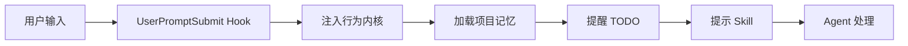
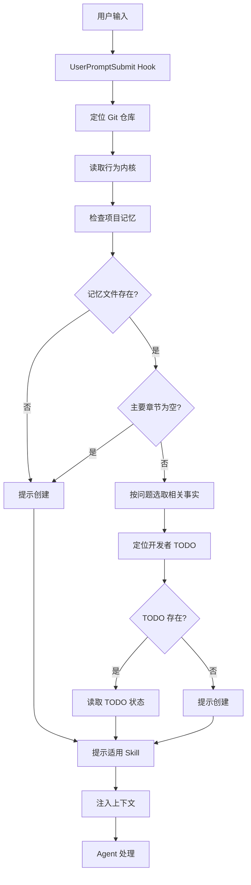

import { Aside } from '@astrojs/starlight/components'

## 概述

UserPromptSubmit Hook 在用户提交每个提示词时触发，负责注入最小行为内核、项目记忆摘要和 TODO 提醒，确保 Agent 始终遵循统一的开发原则和项目上下文。

**关键职责**：
- **行为内核注入**：跨客户端统一的开发原则（1500 bytes 预算）
- **项目记忆加载**：与当前问题相关的事实摘要（3000 bytes 预算）
- **TODO 提醒**：当前开发者的活动任务（2000 bytes 预算）
- **Skill 提示**：适用于当前场景的 Skill

## 触发时机



**每次用户提交提示词时**都会触发，包括：
- 初始问题
- 后续对话
- 命令执行后的反馈
- 明确的续作请求

## 行为内核注入

### 什么是行为内核

行为内核是跨客户端统一的开发原则，定义了 Agent 的基本行为模式。

**源文件**：`runtime-hooks/behavior-kernel.md`

### 六大核心原则

#### 1. 事实先行

```markdown
先读取适用规则、仓库事实和已批准边界；
信息不足时明确缺口，不猜测。
```

**实践**：

```bash
# ❌ 错误（猜测技术栈）
"用 React 实现用户登录页面"

# ✅ 正确（先查看项目记忆）
"查看项目技术栈"
"使用项目现有的 Vue 3 实现用户登录页面"
```

#### 2. 简单优先

```markdown
选择满足目标的最简单方案，
不为假设需求增加抽象、兼容层或流程。
```

**实践**：

```bash
# ❌ 错误（过度设计）
"设计一个支持插件的、可扩展的、高可用的用户认证系统"

# ✅ 正确（简单实现）
"实现基本的用户登录功能（邮箱 + 密码 + JWT）"
```

#### 3. 最小写集

```markdown
只修改目标直接需要的文件与行为，
保留无关现状。
```

**实践**：

```bash
# ❌ 错误（修改无关文件）
实现登录功能时：
- src/api/user/login.ts ✓
- src/pages/login.vue ✓
- src/components/Header.vue ✗（无关）
- src/utils/request.ts ✗（无关）

# ✅ 正确（最小写集）
只修改：
- src/api/user/login.ts
- src/pages/login.vue
```

#### 4. 目标驱动

```markdown
以可观察用户结果、验收和新鲜证据判断完成，
不以文档、代码量或自报状态替代。
```

**实践**：

```bash
# ❌ 错误（自报完成）
"代码写完了"

# ✅ 正确（有证据）
"登录功能完成：
- AC-001: 用户可以登录 → 手工测试通过
- AC-002: Token 存储 → DevTools 验证
- Review: pass"
```

#### 5. 按需加载

```markdown
Harness 原生提供 Skill 路由元数据；
Hook 不重复注入清单，命中后再读取对应 SKILL.md 与必要 references。
```

#### 6. 有界推进

```markdown
已授权且边界明确时直接执行；
只有真实决策、越界或高风险不可逆动作才停门；
委派必须有唯一 Owner 和互斥写集。
```

### 预算控制

行为内核严格控制在 **1500 bytes** 以内：

```bash
# 检查实际大小
node runtime-hooks/scripts/skill-catalog-context.cjs --check

# 输出
行为内核: 1,234 bytes (预算 1,500 bytes) ✓
```

<Aside type="caution">
如果行为内核超过预算，Hook 可能卡死。需要精简内容。
</Aside>

## 项目记忆加载

### 自动确保记忆文件存在

每次请求时，Hook 会：

1. **检查记忆文件**：
   ```bash
   # 按优先级查找
   docs/PROJECT-MEMORY.md
   docs/project-memory.md
   PROJECT-MEMORY.md
   ```

2. **不存在时自动创建**：
   ```bash
   # Hook 提示 Harness 调用
   init-docs → project-details
   ```

3. **主要章节为空时重新采集**：
   ```markdown
   ## Quick facts
   待采集
   
   ## Reuse map
   待采集
   
   ## Boundaries
   待采集
   ```

### 记忆结构

项目记忆包含三大章节：

#### 1. Quick facts（快速事实）

```markdown
## Quick facts

- 技术栈：Vue 3 + Vite + TypeScript + Element Plus
- 后端：Spring Boot 3.2 + MyBatis Plus
- 数据库：MySQL 8.0 + Redis
- 部署：Docker + Nginx
- 认证：JWT + Spring Security
```

#### 2. Reuse map（复用地图）

```markdown
## Reuse map

### API 请求工具
- **路径**：src/utils/request.ts
- **用途**：封装 axios，统一请求/响应处理
- **使用**：`import { request } from '@/utils/request'`

### 表单验证规则
- **路径**：src/utils/validate.ts
- **用途**：通用表单验证规则（邮箱、手机号、密码强度）
- **使用**：`import { emailRule } from '@/utils/validate'`
```

#### 3. Boundaries（边界）

```markdown
## Boundaries

- ❌ 不引入新的状态管理库（已有 Pinia）
- ❌ 不使用 Vuex（项目已迁移到 Pinia）
- ❌ 不引入 jQuery（使用原生 DOM 或 Vue API）
- ✅ UI 组件只使用 Element Plus
- ✅ 日期处理只使用 dayjs
```

### 按问题选取相关事实

Hook 不注入完整记忆文件，只注入与当前问题相关的摘要：

**用户输入**：
```
实现用户登录功能
```

**注入内容**（精简示例）：
```markdown
<project_memory path="docs/PROJECT-MEMORY.md">
Quick facts: 技术栈 Vue 3 + Spring Boot，认证方式 JWT
Reuse map: API 请求工具 src/utils/request.ts
Boundaries: UI 组件只使用 Element Plus
</project_memory>
```

### 预算控制

项目记忆摘要控制在 **3000 bytes** 以内：

- **Quick facts**：最相关的一条完整事实
- **Reuse map**：最相关的一条完整事实
- **Boundaries**：最相关的一条完整事实
- **额外章节**：如果命中，再注入一个相关章节事实

```bash
# 检查实际大小
node runtime-hooks/scripts/skill-catalog-context.cjs --check

# 输出
项目记忆摘要: 2,567 bytes (预算 3,000 bytes) ✓
```

<Aside type="note">
如果超过预算，Hook 会截断并提示直接读取文件：
"项目记忆内容较多，建议直接读取 docs/PROJECT-MEMORY.md"
</Aside>

## TODO 提醒

### 自动定位开发者 TODO

Hook 会按以下优先级获取开发者 ID：

1. **Git user.name**：
   ```bash
   git config user.name
   # 输出: alice-chen
   ```

2. **系统登录用户名**：
   ```bash
   whoami
   # 输出: alice
   ```

3. **环境变量**：
   ```bash
   echo $AGENT_DEVELOPER_NAME
   # 输出: alice-chen
   ```

### TODO 路径规范

```
docs/<developer-id>/tasks/todo/<原文件名>.md
```

**示例**：
```
docs/alice-chen/tasks/todo/user-management.md
docs/bob-wang/tasks/todo/payment-system.md
```

<Aside type="caution">
每个开发者只能有一个活动 TODO。如果发现多个，Hook 会阻断并要求合并。
</Aside>

### 提醒内容

#### 1. 有活动 TODO 时

```markdown
<active_todo path="docs/alice-chen/tasks/todo/user-mgmt.md">
当前 Feature: USER-LOGIN (用户登录)
状态: [~] 进行中
执行实例: agent-123
依赖: USER-REG [x]
写集: src/api/user/login.ts, src/pages/login.vue
AC-001: 用户可以登录 -> ?
AC-002: Token 存储 -> ?
Review: pending

下一个 Ready Feature: USER-PROFILE
</active_todo>
```

#### 2. 规划阶段时

```markdown
<active_planning path="docs/alice-chen/tasks/todo/user-mgmt.md">
当前阶段: requirements-analysis
阶段 Owner: product-manager
下一阶段: requirements-confirmation
阶段记录: 已完成需求采集，等待用户确认
</active_planning>
```

#### 3. 无活动 TODO 时

```markdown
<no_active_todo>
当前开发者: alice-chen
TODO 路径: docs/alice-chen/tasks/todo/
提示: 使用 task-todo-workflow 创建新 TODO
</no_active_todo>
```

### 预算控制

TODO 提醒控制在 **2000 bytes** 以内：

```bash
# 检查实际大小
node runtime-hooks/scripts/skill-catalog-context.cjs --check

# 输出
TODO 提醒: 1,890 bytes (预算 2,000 bytes) ✓
```

## Skill 提示

### 根据场景提示 Skill

Hook 会根据当前状态提示适用的 Skill：

#### 1. 新项目启动

```markdown
<skill_hint>
检测到新项目，建议使用：
- task-todo-workflow: 创建功能+菜单 TODO
- product-manager: 完成产品定义
- architecture-design: 设计系统架构
</skill_hint>
```

#### 2. 需求变更

```markdown
<skill_hint>
检测到需求变更，建议使用：
- change-impact-analysis: 分析影响范围
- project-manager: 更新 TODO
</skill_hint>
```

#### 3. 功能开发

```markdown
<skill_hint>
检测到开发任务，建议使用：
- crud-development: CRUD 功能开发
- api-development: API 开发
- frontend-design: UI/UX 设计
</skill_hint>
```

#### 4. 代码审查

```markdown
<skill_hint>
检测到代码改动，建议使用：
- code-review: 完整代码审查
- check: 后端规范检查
</skill_hint>
```

## 工作原理

### 执行流程



### 输入格式

Hook 通过 stdin 接收 JSON 输入：

```json
{
  "userPrompt": "实现用户登录功能",
  "sessionContext": {
    "workingDirectory": "/project",
    "gitRoot": "/project",
    "sessionId": "abc123"
  }
}
```

### 输出格式

Hook 通过 stdout 返回 JSON 输出：

```json
{
  "systemMessage": "<behavior_kernel>...</behavior_kernel>\n<project_memory>...</project_memory>\n<active_todo>...</active_todo>\n<skill_hint>...</skill_hint>"
}
```

## 上下文预算总览

| 内容 | 预算 | 实际使用示例 | 状态 |
|------|------|-------------|------|
| 行为内核 | 1500 bytes | 1,234 bytes | ✓ |
| 项目记忆 | 3000 bytes | 2,567 bytes | ✓ |
| TODO 提醒 | 2000 bytes | 1,890 bytes | ✓ |
| **总计** | **8000 bytes** | **5,691 bytes** | ✓ |

<Aside type="tip">
保持充足的预算余量（至少 20%），避免超限导致 Hook 卡死。
</Aside>

## 配置选项

### 环境变量

```bash
# 禁用所有 Hook
export AGENT_RUNTIME_HOOKS_DISABLED=1

# 自定义开发者 ID（仅在 Git identity 不可用时）
export AGENT_DEVELOPER_NAME=alice-chen

# 自定义 TODO 目录（仅允许指向规范目录）
export AGENT_TODO_DIR=/repo/docs/alice-chen/tasks/todo

# 启用 Skill 发现兜底（旧客户端）
export AGENT_SKILL_DISCOVERY_FALLBACK=1
```

### 检查命令

```bash
# 检查上下文预算
node runtime-hooks/scripts/skill-catalog-context.cjs --check

# 测试上下文注入（手动）
echo '{"userPrompt":"测试"}' | node runtime-hooks/scripts/skill-catalog-context.cjs
```

## 与 SubagentStart 的关系

**UserPromptSubmit** 和 **SubagentStart** 共享相同的逻辑：

| Hook | 触发时机 | 注入内容 | 目的 |
|------|---------|---------|------|
| UserPromptSubmit | 用户提交提示词 | 行为内核 + 项目记忆 + TODO | 主 Agent 上下文 |
| SubagentStart | Subagent 启动 | 行为内核 + 项目记忆 + TODO | Subagent 上下文 |

**实现**：

```javascript
// session-start.cjs 和 subagent-start.cjs 都调用同一函数
const { injectContext } = require('./skill-catalog-context.cjs');

// UserPromptSubmit
function handleUserPromptSubmit(input) {
  return injectContext(input, 'UserPromptSubmit');
}

// SubagentStart
function handleSubagentStart(input) {
  return injectContext(input, 'SubagentStart');
}
```

## 故障排查

### 项目记忆未加载

**症状**：没有看到 `<project_memory>` 上下文。

**诊断**：

```bash
# 1. 检查文件是否存在
ls docs/PROJECT-MEMORY.md
ls docs/project-memory.md
ls PROJECT-MEMORY.md

# 2. 检查内容
cat docs/PROJECT-MEMORY.md

# 3. 手动触发采集
"初始化项目记忆"
```

**解决方案**：

如果文件不存在或章节为空，Hook 会自动提示创建：

```
检测到项目记忆缺失，建议调用 init-docs 采集事实
```

按提示操作即可。

### TODO 路径不对

**症状**：找不到 TODO 文件或路径错误。

**诊断**：

```bash
# 1. 检查 Git user.name
git config user.name

# 2. 检查预期路径
echo "docs/$(git config user.name)/tasks/todo/"

# 3. 查找实际路径
find docs/ -name "*.md" -path "*/tasks/todo/*"
```

**解决方案**：

```bash
# 设置正确的 Git user.name
git config user.name "alice-chen"
git config user.email "alice@example.com"

# 或移动 TODO 到正确路径
mkdir -p docs/alice-chen/tasks/todo
mv docs/wrong-path/todo/*.md docs/alice-chen/tasks/todo/
```

### 上下文预算超限

**症状**：

```
错误: 上下文预算超限
总计: 9,234 bytes (预算 8,000 bytes)
```

**解决方案**：

```bash
# 1. 检查各部分大小
node runtime-hooks/scripts/skill-catalog-context.cjs --check

# 2. 精简项目记忆（删除过时内容）
vim docs/PROJECT-MEMORY.md

# 3. 精简行为内核（如果自定义了）
vim runtime-hooks/behavior-kernel.md

# 4. 精简 TODO（拆分大 TODO）
vim docs/alice-chen/tasks/todo/project.md
```

### 多个活动 TODO

**症状**：

```
错误: 发现多个活动 TODO
docs/alice-chen/tasks/todo/project1.md
docs/alice-chen/tasks/todo/project2.md
```

**解决方案**：

```bash
# 决定保留哪个 TODO
cat docs/alice-chen/tasks/todo/project1.md
cat docs/alice-chen/tasks/todo/project2.md

# 移动或删除其他 TODO
mv docs/alice-chen/tasks/todo/project2.md docs/alice-chen/tasks/archive/

# 或合并两个 TODO（手动）
```

## 下一步

- [SubagentStart Hook](/skills/hooks/subagent-start) - Subagent 上下文注入
- [Stop Hook](/skills/hooks/stop) - TODO 续作详解
- [项目记忆](/skills/core-concepts/project-memory) - 记忆系统详解
- [TODO 管理](/skills/usage/todo-management) - TODO 使用指南
