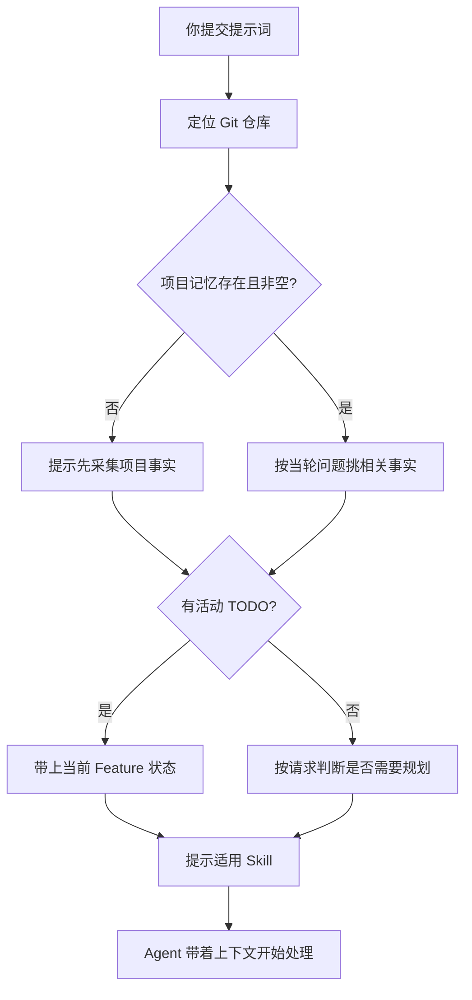

import { Aside } from '@astrojs/starlight/components'

## 这个 Hook 帮你做什么

你每提交一次提示词，UserPromptSubmit Hook 都会替你把当轮真正需要的上下文一起递给 Agent，你不用每次手动交代：

| 注入内容 | 你省掉的动作 |
|---------|------------|
| 一份跨客户端统一的行为准则 | 不用反复叮嘱"先查证再动手""别过度设计" |
| 与当轮问题相关的项目事实摘要 | 不用每次说明技术栈、可复用工具、禁用项 |
| 当前开发者的活动 TODO 状态 | 不用重复交代做到哪一步了 |
| 当前场景的辅助 Skill 提示 | 提供候选名称，具体使用仍按 Harness 发现结果和 Skill 正文判断 |

**触发时机**：每次提交提示词都会触发——首个问题、后续追问、命令执行后的反馈、明确的续作请求。

## 行为准则注入

Hook 会注入一份跨客户端统一的行为准则，Claude Code 和 Codex 拿到的是同一份。它约束的是 Agent 的工作方式：先取证再动手、选够用的最简方案、只改必要的文件、用可观察结果判断完成、需要你决策时停下来问。

你能观察到的效果，是 Agent 不太会凭猜测选技术栈，也不太会顺手改一堆无关文件。

<Aside type="note">
准则是全局统一的，不按项目定制。项目特有的约束写进项目记忆的 Boundaries 章节。
</Aside>

如果共享 `behavior-kernel.md` 缺失或格式暂时不合规，本 Hook 会带上不可用提示并成功返回，避免把每次输入拦住；它不会在项目中生成第二份原则。修复 Skills 源文件后运行安装器并重启客户端，详见 [Hook 故障排查](/skills/hooks/troubleshooting/#行为内核校验失败)。

## 项目记忆

### 文件位置

Hook 每轮会确认仓库里存在唯一一份项目记忆，按以下顺序查找：

```
PROJECT-MEMORY.md
docs/PROJECT-MEMORY.md
docs/project-memory.md
```

文件不存在时会在仓库根创建模板；主要章节还是空时，Hook 提示 Agent 通过 `init-docs` 采集事实，再由 `project-details` 原位归并。

### 三个章节

**Quick facts** — 项目的稳定事实：

```markdown
## Quick facts

- 技术栈：Vue 3 + Vite + TypeScript + Element Plus
- 后端：Spring Boot 3.2 + MyBatis Plus
- 数据库：MySQL 8.0 + Redis
- 认证：JWT + Spring Security
```

**Reuse map** — 已有的可复用资产，避免重复造轮子：

```markdown
## Reuse map

### API 请求工具
- 路径：src/utils/request.ts
- 用途：封装 axios，统一请求/响应处理

### 表单验证规则
- 路径：src/utils/validate.ts
- 用途：通用验证规则（邮箱、手机号、密码强度）
```

**Boundaries** — 明确禁止和明确要求：

```markdown
## Boundaries

- ❌ 不引入新的状态管理库（已有 Pinia）
- ❌ 不引入 jQuery
- ✅ UI 组件只使用 Element Plus
- ✅ 日期处理只使用 dayjs
```

### 只注入相关的部分

Hook 不会把整份记忆塞进上下文，而是按当轮问题挑相关章节的事实。你问"实现用户登录功能"，Agent 拿到的就是这个项目的技术栈与认证方式、可复用的请求工具、以及 UI 组件库这条边界——你不必自己重述。

<Aside type="tip">
记忆写得越具体，注入的摘要越有用。内容过多时 Hook 会截断并提示 Agent 直接读文件，所以把不再成立的旧事实删掉，比一直往里堆更有效。
</Aside>

## TODO 提醒

### 开发者身份怎么确定

按优先级：

| 顺序 | 来源 | 怎么看 |
|-----|------|-------|
| 1 | 仓库 Git `user.name` | `git config user.name` |
| 2 | 系统登录用户名 | `whoami` |
| 3 | 环境变量 `AGENT_DEVELOPER_NAME` | 前两者都不可用时才用 |

### TODO 路径

```
docs/<developer-id>/tasks/todo/<原文件名>.md
```

例如：

```
docs/alice-chen/tasks/todo/user-management.md
docs/bob-wang/tasks/todo/payment-system.md
```

<Aside type="caution">
每个开发者只能有一份活动 TODO。出现多份或实例冲突时，先核对归属与未完成项，再通过任务维护流程处理，不由 Agent 猜测或直接移动文件。
</Aside>

### 你不必每轮重述进度

Hook 带上当前 Feature 的路径与标识，并提示 Agent 回读原始 TODO，核对依赖、写集、验收和阶段。注入是有界提醒，不保证每轮都包含所有 AC、Review 结果和下一项详情。

你可以直接说“继续”或“接着做下一个”，Agent 再按当前授权读取对应任务。没有活动 TODO 时是否需要创建，取决于本轮是否为需要规划的业务功能；普通答复与低风险文档维护不因此增加任务清单。

## Skill 提示

本地 `skill-router.yaml` 命中时可产生场景与候选 Skill 提示。它不读取各 `SKILL.md` 的 frontmatter，也不自动执行 `gates` 或 `related_skills.after`。Harness 负责原生发现与按需加载，Agent 按实际要求判断；你也可以直接点名 Skill。

## 处理流程



## 配置

| 环境变量 | 设成什么 | 效果 |
|---------|---------|------|
| `AGENT_RUNTIME_HOOKS_DISABLED` | `1` | 不关闭本页上下文脚本；只影响部分其他 Hook |
| `AGENT_DEVELOPER_NAME` | 开发者 ID | Git identity 与系统登录用户名都不可用时兜底 |
| `AGENT_TODO_DIR` | 目录路径 | 指定 TODO 目录，只接受符合规范的路径 |
| `AGENT_SKILL_DISCOVERY_FALLBACK` | `1` | 为不支持原生 Skill 发现的旧客户端打开兜底 |

环境变量需要在启动客户端之前导出。

## 和 SubagentStart 的关系

两者注入的内容一致，只是时机不同：

| Hook | 什么时候触发 | 谁拿到上下文 |
|------|------------|------------|
| UserPromptSubmit | 你提交提示词时 | 主 Agent |
| SubagentStart | Subagent 启动时 | Subagent |

所以派给 Subagent 的任务不会丢掉项目事实和 TODO 状态。

## 故障排查

### Agent 好像不知道项目技术栈

说明项目记忆没被加载。检查文件在不在、内容是不是还空着：

```bash
ls docs/PROJECT-MEMORY.md docs/project-memory.md PROJECT-MEMORY.md 2>/dev/null
cat docs/PROJECT-MEMORY.md
```

章节为空或文件缺失时，直接说"初始化项目记忆"，Agent 会采集事实并填好。

### TODO 找不到或路径不对

```bash
# 1. 当前身份
git config user.name

# 2. 预期路径
echo "docs/$(git config user.name)/tasks/todo/"

# 3. 实际有哪些
find docs/ -name "*.md" -path "*/tasks/todo/*"
```

核对 Hook 注入的 `<developer_scope>` 和系统用户名。`developer-id` 会规范化，不能只用原始 `git user.name` 拼接路径。身份确实错误时先修正仓库 Git 配置；历史 TODO 的归属和迁移应通过 `task-todo-workflow` 处理，不直接移动其他开发者的文件。

### 提示存在多份活动 TODO

先只读核对每份 TODO 的归属、当前实例和正在执行的 Feature，再由 `task-todo-workflow` 合并或处理历史落点。不要通过直接移动文件解除仍被其他实例领取的任务。

### 注入的上下文被截断

内容过多时会截断，Agent 应直接读取相关源章节。通过 `project-details` 归并过时事实；唯一 TODO 保留完整功能，不为缩短注入而拆成多个活动清单。

## 下一步

- [SubagentStart Hook](/skills/hooks/subagent-start/) - Subagent 上下文注入
- [Stop Hook](/skills/hooks/stop/) - TODO 续作
- [项目记忆](/skills/core-concepts/project-memory/) - 记忆系统详解
- [TODO 管理](/skills/usage/todo-management/) - TODO 使用指南
