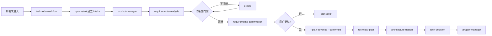

import { Aside } from '@astrojs/starlight/components'

## 概述

`product-manager` 是 **High 优先级** Skill，负责新项目或新功能的完整产品定义。从需求研究、方案收敛到产品定义、验收条件，覆盖用户、能力、菜单、规则、权限、状态与验收的全部产品维度。

**核心职责**：
- 需求清晰度门禁（配合 grilling）
- 产品研究与方案发散收敛（配合 brainstorm）
- 完整产品定义（用户、能力、菜单、规则、权限、验收）
- 产品能力与菜单架构映射
- UI/UX 设计协调（调用 frontend-design）
- 向 project-manager 提供完整产品事实

<Aside type="caution">
产品工作必须完整。流程精简只删除重复 Context、Contract、Evidence、Approval 和摘要计算，不减少研究、设计输入、功能范围或验收。
</Aside>

## 触发条件

### Triggers（触发词）

**中文**：
- 产品定义
- 完整需求
- 产品规划
- 新项目
- 新功能
- 需求分析
- PRD

**English**：
- product definition
- requirements
- PRD
- product planning

### Gates（前置条件）

1. **新项目或尚未规划的新功能**（非已批准 TODO 的续作）
2. **需求需要完整定义**（用户、能力、菜单、规则、权限、验收）
3. **存在唯一 TODO 文件且已执行 --plan-start**

<Aside type="note">
已批准 TODO 的实现续作、Bug、编译修复和不改变行为的维护不重复进入产品流程。
</Aside>

## 使用场景

### 场景 1：全新项目启动

**用户输入**：
```
我要做一个用户管理系统，支持注册、登录、权限管理
```

**Skill 行为**：

1. **需求清晰度门禁**：
   ```markdown
   - 用户角色有哪些？（普通用户、管理员、超级管理员？）
   - 权限管理的粒度？（页面级、功能级、数据级？）
   - 注册方式？（邮箱、手机号、第三方登录？）
   - 是否需要审批流程？
   - 数据隔离要求？（单租户、多租户？）
   ```

2. **产品研究**：
   ```markdown
   - 检查仓库已有认证方式
   - 调研常见权限模型（RBAC、ABAC）
   - 分析用户旅程：注册 → 登录 → 使用 → 管理
   - 识别技术约束：现有框架、数据库、前端技术栈
   ```

3. **方案发散与收敛**（调用 brainstorm）：
   ```markdown
   **权限模型方案**：
   - 方案 A: RBAC（角色-权限）- 简单直接，适合中小型系统
   - 方案 B: ABAC（属性-权限）- 灵活强大，适合复杂场景
   
   **选择**: 方案 A（RBAC），理由：系统规模适中，RBAC 足够
   ```

4. **完整产品定义**：
   ```markdown
   ## 项目身份与定位
   
   **名称**: 用户权限管理系统
   **目标用户**: 企业内部员工、系统管理员
   **核心价值**: 统一用户认证、精细化权限控制、安全审计
   **边界**: 只管理系统内用户，不对接外部 HR 系统
   
   ---
   
   ## 角色与调用方
   
   1. **普通用户**: 注册、登录、查看个人信息
   2. **管理员**: 用户管理、角色分配
   3. **超级管理员**: 权限配置、系统设置、审计日志
   
   ---
   
   ## 系统能力
   
   ### CAP-001: 用户注册
   - 用户可通过邮箱注册账号
   - 邮箱验证后激活
   - 默认分配"普通用户"角色
   
   ### CAP-002: 用户登录
   - 支持邮箱 + 密码登录
   - 登录失败 5 次锁定 15 分钟
   - 生成 JWT Token，7 天有效期
   
   ### CAP-003: 权限管理
   - 管理员可分配/撤销用户角色
   - 角色与权限点绑定
   - 权限变更实时生效
   
   ---
   
   ## 用户旅程
   
   ### 旅程 1: 新用户注册并使用系统
   
   1. 访问注册页面
   2. 输入邮箱、密码、姓名
   3. 收到验证邮件，点击链接激活
   4. 登录系统
   5. 查看可访问的功能菜单
   
   ---
   
   ## 菜单与入口
   
   ### MENU-001: 用户管理
   - 父菜单: 系统管理
   - 路由: /admin/users
   - 权限: user:list
   - 对应 Feature: USER-LIST, USER-CREATE, USER-EDIT
   
   ### MENU-002: 角色管理
   - 父菜单: 系统管理
   - 路由: /admin/roles
   - 权限: role:list
   - 对应 Feature: ROLE-LIST, ROLE-CREATE, ROLE-EDIT
   
   ---
   
   ## 功能需求
   
   ### 用户注册
   
   **正常流程**:
   - 输入邮箱、密码、姓名
   - 发送验证邮件
   - 用户点击激活链接
   - 账号激活成功
   
   **异常处理**:
   - 邮箱已存在: 提示"邮箱已被注册"
   - 验证邮件未收到: 提供"重发验证邮件"按钮
   - 激活链接过期: 提示重新注册
   
   **并发与幂等**:
   - 邮箱唯一性数据库约束
   - 重复点击激活链接: 返回"已激活"状态
   
   ---
   
   ## 数据与权限
   
   ### 数据归属
   - 用户数据: 用户本人可读写个人信息
   - 用户列表: 管理员可读所有用户
   - 角色配置: 超级管理员独占
   
   ### 敏感字段
   - 密码: 加密存储（BCrypt）
   - 邮箱: 脱敏展示（u***@example.com）
   - 登录日志: 保留 90 天后归档
   
   ### 审计
   - 用户登录/登出记录
   - 权限变更记录
   - 敏感操作记录（删除用户、修改权限）
   
   ---
   
   ## 跨端交付
   
   ### Web 端
   - 管理后台: 完整功能
   - 用户中心: 个人信息管理
   
   ### 移动端（可选）
   - 仅提供登录和个人信息查看
   - 不提供管理功能
   
   ---
   
   ## 指标与验收
   
   ### 指标
   - 注册转化率 = 激活用户数 / 注册请求数
   - 登录成功率 = 成功登录数 / 登录尝试数
   - 平均响应时间 < 500ms
   
   ### 验收条件
   
   **AC-001: 用户可以注册**
   - 给定: 用户访问注册页面
   - 当: 输入有效邮箱和密码
   - 则: 收到验证邮件，点击后账号激活
   
   **AC-002: 用户可以登录**
   - 给定: 用户已激活账号
   - 当: 输入正确的邮箱和密码
   - 则: 成功登录，跳转到首页，可访问授权功能
   
   **AC-003: 管理员可以分配角色**
   - 给定: 管理员登录系统
   - 当: 为用户分配"管理员"角色
   - 则: 用户刷新后可访问管理菜单
   
   ---
   
   ## 非目标与阶段
   
   **本阶段不做**:
   - 第三方登录（OAuth2）- 延期到 V2
   - 单点登录（SSO）- 等待企业级需求确认
   - 用户导入/导出 - 优先级低
   
   **后续触发条件**:
   - 用户量达到 1000 时考虑 SSO
   - 收到 5 个以上第三方登录需求时开发
   
   ---
   
   ## 风险与开放问题
   
   **风险**:
   - 邮件发送失败率高可能影响注册转化
   - Token 有效期 7 天可能不符合安全要求
   - 并发登录未限制，存在账号共享风险
   
   **开放问题**:
   - 密码强度规则？（当前未限制）
   - 是否需要二次验证？
   - Token 刷新机制？
   ```

5. **UI/UX 协调**（调用 frontend-design）：
   ```markdown
   请为用户注册、登录、用户列表、角色管理页面设计 UI/UX 基线
   ```

6. **交给 project-manager**：
   ```markdown
   产品定义已完成，包含：
   - 3 个角色、3 个核心能力
   - 2 个主菜单、4 个用户旅程
   - 完整验收条件、数据权限规则
   - UI/UX 设计基线（待 frontend-design 完成）
   
   下一步: 架构设计 → 技术选型 → 生成 TODO
   ```

### 场景 2：新增单个功能

**用户输入**：
```
增加用户导出功能，管理员可以导出用户列表为 Excel
```

**Skill 行为**：

1. **需求清晰度门禁**：
   ```markdown
   - 导出哪些字段？（姓名、邮箱、角色、注册时间？）
   - 是否需要筛选条件？（按角色、注册时间范围？）
   - 导出量级？（几百、几千、几万？）
   - 是否需要异步导出？（大数据量时邮件通知）
   - 敏感字段如何处理？（密码、手机号脱敏？）
   ```

2. **产品定义**：
   ```markdown
   ## 功能：用户导出
   
   **目标**: 管理员可导出用户列表用于数据分析和备份
   
   **能力**: CAP-004: 用户数据导出
   
   **入口**: 用户管理页面 → "导出" 按钮
   
   **流程**:
   1. 管理员设置筛选条件（可选）
   2. 点击"导出"按钮
   3. 系统生成 Excel 文件
   4. 浏览器自动下载
   
   **字段**:
   - 姓名、邮箱、角色、注册时间、最后登录时间
   - 密码字段不导出
   - 手机号脱敏显示
   
   **限制**:
   - 单次最多导出 10,000 条
   - 超过 10,000 条提示分批导出
   
   **验收**:
   - AC-004: 管理员可以导出用户列表
     - 给定: 管理员访问用户管理页面
     - 当: 点击"导出"按钮
     - 则: 下载包含用户数据的 Excel 文件，字段完整且脱敏正确
   
   **权限**: user:export
   
   **风险**: 大数据量导出可能阻塞主线程，建议异步处理
   ```

### 场景 3：复杂功能规划

**用户输入**：
```
增加审批流功能，用户注册需要管理员审批
```

**Skill 行为**：

1. **需求清晰度门禁**（调用 grilling）：
   ```markdown
   Q1: 审批流程是串行还是并行？
   A: 串行，只需要一个管理员审批即可

   Q2: 审批超时如何处理？
   A: 7 天未审批自动拒绝

   Q3: 审批拒绝后用户可以重新注册吗？
   A: 可以，但需要等待 24 小时

   Q4: 审批人如何分配？
   A: 轮询分配给所有管理员

   Q5: 审批人可以转交吗？
   A: 暂不支持
   ```

2. **方案发散**（调用 brainstorm）：
   ```markdown
   **方案 A**: 简单状态机（pending → approved/rejected）
   - 优点: 实现简单，满足基本需求
   - 缺点: 扩展性差，无法支持多级审批

   **方案 B**: 工作流引擎（Activiti/Flowable）
   - 优点: 扩展性强，支持复杂流程
   - 缺点: 引入复杂度，学习成本高

   **选择**: 方案 A（简单状态机）
   **理由**: 当前只需要一级审批，方案 A 足够；未来需要多级时再重构
   ```

3. **完整产品定义**：
   ```markdown
   ## 功能：注册审批流
   
   ### 能力：CAP-005: 用户注册审批
   
   **用户流程**:
   1. 用户提交注册信息
   2. 系统创建"待审批"账号
   3. 用户看到"等待审批"提示
   4. 管理员收到审批通知
   5. 管理员审批通过/拒绝
   6. 用户收到审批结果通知
   7. 通过则激活账号，拒绝则账号失效
   
   **管理员流程**:
   1. 管理员看到"待审批用户"列表
   2. 查看用户注册信息
   3. 点击"通过"或"拒绝"
   4. 填写审批意见（可选）
   5. 提交审批结果
   
   **状态机**:
   ```
   pending → approved → active
           → rejected → inactive
           → expired (7天超时) → inactive
   ```
   
   **数据模型**:
   - 用户表增加字段: status (pending/approved/rejected/expired)
   - 审批记录表: user_id, reviewer_id, action, reason, created_at
   
   **通知**:
   - 提交注册: 发送邮件给轮询分配的管理员
   - 审批通过: 发送激活邮件给用户
   - 审批拒绝: 发送拒绝原因邮件给用户
   - 审批超时: 发送超时通知给用户
   
   **权限**:
   - user:approve: 审批权限
   - user:approve:list: 查看待审批列表
   
   **验收**:
   - AC-005: 用户注册后需要审批
   - AC-006: 管理员可以审批用户注册
   - AC-007: 审批超时自动拒绝
   
   **风险**:
   - 审批人离职或长期不在线导致审批积压
   - 建议: 实现审批转交功能（延期到 V2）
   ```

## 工作原理

### 阶段入口与交接



### 规划档位与自主边界

**规划档位** (Planning Level):

| 档位 | 适用场景 | 保留内容 | 裁剪内容 |
|------|---------|---------|---------|
| **Lite** | 已批准范围的低风险续作、纯文案/配置/重命名 | 目标、入口、最小 AC、技术核对、交付面、验证、Review | 市场研究、brainstorm、独立架构文档 |
| **Standard** | 新增用户行为、菜单/页面、API、数据或跨层联动 | 完整产品定义、设计、架构、技术 | - |
| **High-risk** | 权限/租户、迁移/删除、公开契约、并发/幂等、资金、跨仓/外部集成、难回滚 | Standard + 风险/回滚矩阵、人工决策边界、方案复核 | - |

**自主模式** (Mode):

| 模式 | 说明 | 授权范围 |
|------|------|---------|
| **Goal** | 允许在明确目标、白名单和可回滚预算内连续推进 | 可自主完成规划和实施 |
| **Plan** | 仍有关键需求/方案/不可逆决策 | 只产出待批准结论，不进入可领取 TODO |
| **Build** | 已批准方案和 TODO 的直接续作 | 不重复要求多方案或文件写入确认 |

<Aside type="tip">
向下游只传一条紧凑结论：`Planning level + mode / Why / Kept / Trimmed / Escalate when`
</Aside>

### 完整产品定义的 12 项内容

1. **项目身份与定位**: 名称、含义、目标用户、核心价值和边界
2. **角色与调用方**: 用户角色、后台运营、管理员、Agent、系统或外部调用方
3. **系统能力**: 稳定 capabilityId、用户可观察结果、规则、数据和权限边界
4. **用户旅程**: 入口、前置条件、主流程、分支、失败、恢复和完成结果
5. **菜单与入口**: menuId、父子关系、标签、路由/窗口/命令/事件入口及对应 Feature
6. **功能需求**: 正常、空、错误、重复、并发、超时、权限不足、数据过期和取消/撤销等适用行为
7. **数据与权限**: 数据归属、可见范围、租户/组织边界、敏感字段、审批、审计和保留规则
8. **跨端交付**: Web/App/Desktop 的一致行为和平台差异
9. **外部集成**: 触发、认证、幂等、限流、失败、补偿、重试、人工接管和退出路径
10. **指标与验收**: 指标公式、总体、窗口、数据源、基线/目标状态和护栏
11. **非目标与阶段**: 明确本阶段不做什么、延期原因和后续触发条件
12. **风险与开放问题**: 影响价值、可用性、可行性、安全、数据、成本或交付的真实风险

<Aside type="caution">
不得虚构用户、市场数据、负责人、日期、批准、指标提升或已完成状态。
</Aside>

### 产品能力与菜单架构映射

```text
requirement -> capability -> journey -> menu/entry -> feature -> acceptance
```

**映射规则**:
- 每个项目文档承诺能力、角色旅程、菜单和验收必须映射到至少一个 Feature
- 每个 Feature 必须回指真实需求、用户结果和入口
- 禁止按数据库、后端、前端、Review 或 Git 伪造功能点
- 菜单只是入口；同一功能的数据、API、backend、Web/App/Desktop、权限和集成仍属于一个纵向交付单元

**示例**:

```markdown
## Capability: CAP-001 用户注册

### Journey: 新用户注册流程
1. 访问注册页面
2. 输入邮箱、密码
3. 收到验证邮件
4. 点击激活链接
5. 账号激活成功

### Menu: 无（公开入口）
- 路由: /register
- 权限: 公开访问

### Features:
- USER-REG-API: 注册 API 实现
  - 写集: AuthController.register(), UserEntity, 邮件服务
  - 验收: AC-001: 用户可以通过邮箱注册

- USER-REG-PAGE: 注册页面实现
  - 写集: register.vue, 表单验证
  - 验收: AC-002: 注册页面展示正确，表单验证有效

- USER-REG-EMAIL: 邮件验证实现
  - 写集: EmailService, 验证 token 生成
  - 验收: AC-003: 用户收到验证邮件，点击后激活
```

## 输出格式

### 产品定义文档

```markdown
# {项目名称} 产品定义

## 一、项目身份与定位

**名称**: {项目名称}
**目标用户**: {用户群体}
**核心价值**: {核心价值主张}
**边界**: {做什么，不做什么}

---

## 二、角色与调用方

1. **{角色1}**: {职责和权限}
2. **{角色2}**: {职责和权限}

---

## 三、系统能力

### CAP-001: {能力名称}
- {能力描述}
- {规则}
- {权限边界}

---

## 四、用户旅程

### {旅程名称}
1. {步骤1}
2. {步骤2}
...

---

## 五、菜单与入口

### MENU-001: {菜单名称}
- 父菜单: {父菜单}
- 路由: {路由路径}
- 权限: {权限代码}
- 对应 Feature: {Feature ID 列表}

---

## 六、功能需求

### {功能名称}

**正常流程**: ...
**异常处理**: ...
**并发与幂等**: ...

---

## 七、数据与权限

### 数据归属
- {数据类型}: {归属规则}

### 敏感字段
- {字段名}: {处理方式}

### 审计
- {审计项}: {保留规则}

---

## 八、跨端交付

### Web 端
- {功能列表}

### 移动端
- {功能列表}

---

## 九、外部集成

### {集成名称}
- 触发条件: ...
- 认证方式: ...
- 失败处理: ...

---

## 十、指标与验收

### 指标
- {指标名称} = {公式}

### 验收条件

**AC-001: {验收描述}**
- 给定: {前置条件}
- 当: {操作}
- 则: {预期结果}

---

## 十一、非目标与阶段

**本阶段不做**:
- {非目标1} - {原因}
- {非目标2} - {原因}

**后续触发条件**:
- {条件} 时考虑 {功能}

---

## 十二、风险与开放问题

**风险**:
- {风险描述}
- {影响和缓解措施}

**开放问题**:
- {问题描述}
- {待决策内容}

---
```

## 与其他 Skill 的关系

### Conflicts（职责边界）

| Skill | 边界说明 |
|-------|---------|
| `universal-development` | `universal-development` 负责已有产品定义的实现；`product-manager` 负责新项目/新功能的产品定义 |
| `change-impact-analysis` | `change-impact-analysis` 负责已有范围的变更分析；`product-manager` 负责新项目/新功能的完整定义 |

### Related Skills

**前置依赖** (before):
- `task-todo-workflow` - 建立流程状态机

**后续推荐** (after):
- `architecture-design` - 系统架构设计
- `tech-decision` - 技术方案选择
- `project-manager` - 生成功能 TODO

**协作 Skill** (complement):
- `product-discovery` - 用户研究与机会验证
- `product-execution` - PRD 与路线图
- `brainstorm` - 方案发散与收敛
- `grilling` - 需求追问与澄清

## 最佳实践

### 1. 必须走完清晰度门禁

```markdown
<!-- 错误: 需求不清晰就开始定义 -->
用户要一个权限管理功能
→ 直接输出产品定义

<!-- 正确: 先澄清需求 -->
用户要一个权限管理功能
→ 调用 grilling 澄清:
   - 权限粒度？
   - 角色模型？
   - 数据隔离？
→ 达到 95% 清晰度
→ 输出产品定义
```

### 2. 复用项目记忆

```markdown
每次需求进入时先消费 Runtime 自动读取的 PROJECT-MEMORY.md 相关事实：

**Quick facts**:
- 后端框架: Spring Boot 2.7
- 数据库: MySQL 8.0
- 认证方式: JWT

**Reuse map**:
- 用户认证: 复用 AuthController
- 权限注解: 复用 @RequirePermission

**Boundaries**:
- 不对接外部 HR 系统
- 不支持 LDAP

逐项判断: reuse / extend / not-applicable
```

### 3. 产品能力必须映射到 Feature

```markdown
<!-- 错误: 只列能力，不映射 Feature -->
系统能力:
- 用户可以注册
- 用户可以登录

<!-- 正确: 能力 → Feature 映射 -->
CAP-001: 用户注册
  → Feature: USER-REG-API (后端)
  → Feature: USER-REG-PAGE (前端)
  → Feature: USER-REG-EMAIL (邮件)

CAP-002: 用户登录
  → Feature: USER-LOGIN-API (后端)
  → Feature: USER-LOGIN-PAGE (前端)
```

### 4. 验收条件必须可观察

```markdown
<!-- 错误: 不可观察 -->
AC-001: 代码已写
AC-002: 数据库表已创建

<!-- 正确: 可观察的用户结果 -->
AC-001: 用户可以通过邮箱注册
  - 给定: 用户访问注册页面
  - 当: 输入有效邮箱和密码
  - 则: 收到验证邮件，点击后账号激活

AC-002: 用户可以登录
  - 给定: 用户已激活账号
  - 当: 输入正确的邮箱和密码
  - 则: 成功登录，跳转到首页
```

### 5. 后端功能必须包含真实页面

```markdown
<!-- 错误: 只定义后端 -->
Feature: USER-REG-API
  - 注册 API 实现
  - 数据库表
  - 邮件发送

<!-- 正确: 包含完整交付面 -->
Feature: USER-REG (完整注册功能)
  - USER-REG-API: 后端 API
  - USER-REG-PAGE: 前端页面
  - USER-REG-EMAIL: 邮件验证
  - 验收: 用户可以完整走通注册流程
```

## 完成检查清单

产品定义完成前，检查以下项：

- [ ] 项目介绍中的全部承诺能力是否有 Feature 与入口
- [ ] 用户、规则、权限、数据、正常/异常/恢复和验收是否完整
- [ ] 后端功能有页面时是否包含真实客户端交付
- [ ] 纯后端是否写明真实调用方
- [ ] 指标、风险、非目标和未知项是否真实
- [ ] 是否只减少流程记录，而没有删减任何产品能力
- [ ] 验收条件是否可观察（不能用"代码已写"代替用户结果）
- [ ] 是否虚构用户、市场数据、负责人、日期、批准或指标提升

## 下一步

- [architecture-design](/skills/skills-reference/high/architecture-design) - 系统架构设计
- [tech-decision](/skills/skills-reference/high/tech-decision) - 技术方案选择
- [project-manager](/skills/skills-reference/high/project-manager) - 生成功能 TODO
- [frontend-design](/skills/skills-reference/high/frontend-design) - UI/UX 设计基线
- [grilling](/skills/skills-reference/medium/grilling) - 需求追问与澄清
- [brainstorm](/skills/skills-reference/medium/brainstorm) - 方案发散与收敛
