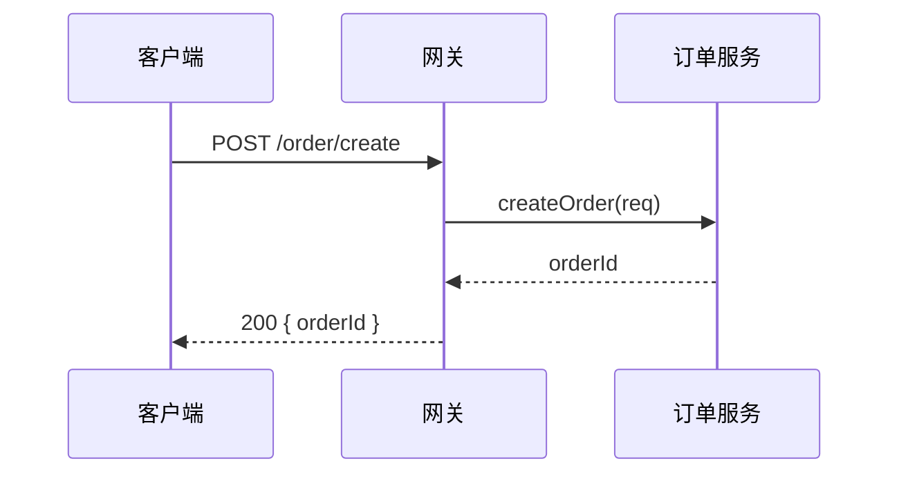

import { Aside } from '@astrojs/starlight/components';

大多数"画个架构图"的请求，最后都停在一张糊掉的截图，或者一段没人愿意再维护的 Mermaid 上。这个 Skill 走的是另一条路：你用大白话描述系统，或者直接把一段 Mermaid 贴进来，它先把内容收敛成一份带类型约束的 JSON，再渲染成**一个自包含的 HTML 文件**。双击就能开，里面有 SVG、明暗两套主题、平移缩放、搜索定位、关系高亮，以及真正能用的导出（PNG、JPEG、WebP、SVG、WebM）。

它替你决定的是这几件事：这个场景该用哪种图、主路径怎么排、标签放在哪、几何上有没有真的通过检查。它不做架构决策本身，不写实现代码，也不画业务数据图表——柱状图、折线图、指标看板那类不属于它。

## 和 mermaid 的分工

| 你要的东西 | 走哪个 |
| --- | --- |
| 一段贴进 README 或 PR 描述里的小图，三五个节点 | [mermaid](/skills/skills-reference/low/mermaid/)，几行文本搞定 |
| 一张要给别人讲、要能点开探索、要导出成图片的系统图 | 本 Skill |
| 手上已经有 Mermaid，但它渲出来太挤、看不清 | 本 Skill，把那段贴进来 |

判断依据是产物形态：只需要文本里内嵌一张图就用 Mermaid，为一个三节点流程生成独立 HTML 是投入过头了。

## 什么时候用

| 你会这样说 | 你会拿到什么 |
| --- | --- |
| "画个架构图" | 一个可探索的 HTML，含组件、依赖和边界分组 |
| "帮我出个系统图，要给评审看" | 同上，另加多分辨率截图作为证据 |
| "这个流程画成图" | 带判断分支和终态的流程图 |
| "画个时序图" | 参与者、消息、返回过程和异步轨迹 |
| "数据是怎么流的" | 数据管道图，含来源、加工和消费方 |
| "这个订单状态机画一下" | 状态与转换图，含重试和终态 |
| "把这段 Mermaid 美化一下" | 语义迁移后的交互式 HTML |

## 什么时候不要用

- 只要一段简单图表贴进文档 → [mermaid](/skills/skills-reference/low/mermaid/)。
- 要决定系统怎么分层、模块怎么划、部署成什么形态 → [architecture-design](/skills/skills-reference/high/architecture-design/)。这里只把已有结论画出来，不产生结论。
- 要写代码 → [universal-development](/skills/skills-reference/low/universal-development/) 或对口专业 Skill。
- 需求还没定 → [product-manager](/skills/skills-reference/critical/product-manager/)。
- 要画销量趋势、指标看板、统计分布 → 不在它范围内。

## 前置条件

得有一个确实需要被看见的结构或流程，而且它属于系统图、流程、时序、数据流、状态机这几类之一；还得确实需要一个可交互的产物。

图要反映真实代码的时候，节点得从仓库里核对出来——不能照着示例文件里的样子编几个服务名填上。第三条也值得先想一下：如果最终只是贴进 README 的一张静态小图，Mermaid 更划算。

拿不准场景属于哪一类时，让它先跑一次导航：

```bash
node bin/archify.mjs guide "订单支付回调的失败重试链路" --json
```

## 使用示例

### 示例 1：从一句话到一个 HTML

你说："画个订单系统的架构图，网关后面是订单服务和支付服务，订单读写 MySQL，支付回调走消息队列，Redis 做幂等。"

先落一份候选 JSON。节点不多，主路径清楚：

```json
{
  "meta": { "title": "订单系统架构", "quality_profile": "showcase" },
  "groups": [
    { "id": "edge",  "label": "接入层" },
    { "id": "app",   "label": "应用层" },
    { "id": "data",  "label": "数据与中间件" }
  ],
  "nodes": [
    { "id": "web",     "label": "管理端",     "group": "edge", "kind": "client" },
    { "id": "gateway", "label": "API 网关",   "group": "edge", "kind": "gateway" },
    { "id": "order",   "label": "订单服务",   "group": "app",  "kind": "service" },
    { "id": "pay",     "label": "支付服务",   "group": "app",  "kind": "service" },
    { "id": "mysql",   "label": "MySQL",      "group": "data", "kind": "database" },
    { "id": "redis",   "label": "Redis",      "group": "data", "kind": "cache" },
    { "id": "mq",      "label": "回调队列",   "group": "data", "kind": "queue" }
  ],
  "edges": [
    { "from": "web",     "to": "gateway", "label": "HTTPS" },
    { "from": "gateway", "to": "order" },
    { "from": "gateway", "to": "pay" },
    { "from": "order",   "to": "mysql",  "label": "读写" },
    { "from": "pay",     "to": "redis",  "label": "幂等键" },
    { "from": "pay",     "to": "mq",     "label": "回调事件" },
    { "from": "mq",      "to": "order",  "label": "消费更新状态" }
  ]
}
```

改完立刻验证，不要靠肉眼推坐标：

```bash
node bin/archify.mjs validate architecture order-arch.json --quality showcase --json
```

```text
{ "ok": true,
  "profile": "showcase",
  "checks": 9,
  "composition": { "errors": 0, "warnings": 0 },
  "nodes": 7, "edges": 7 }
```

九项检查全报告、错误和告警都为零，才算这一档通过。只回执四项的属于基础验证，不等于过了。

交付：

```bash
node bin/archify.mjs deliver architecture order-arch.json order-arch.html \
  --quality showcase --json
```

```text
{ "output": "order-arch.html",
  "spec":     { "sha256": "3f9a…c12", "bytes": 2184 },
  "artifact": { "sha256": "b70d…4ae", "bytes": 268431 } }
```

`deliver` 会把这份 JSON 的字节冻结成同目录的私有快照，渲染并检查那份快照，再原子写出 HTML。此后候选文件就不该再改了。

### 示例 2：粘一段 Mermaid 进来

你说："把这个美化一下。"



它读的是拓扑和含义，不是样式——参与者变成语义参与者，箭头变成消息，返回过程保留：

```json
{
  "meta": { "title": "下单调用链", "quality_profile": "showcase" },
  "participants": [
    { "id": "client",  "label": "管理端",   "kind": "client" },
    { "id": "gateway", "label": "API 网关", "kind": "gateway" },
    { "id": "order",   "label": "订单服务", "kind": "service" }
  ],
  "messages": [
    { "from": "client",  "to": "gateway", "label": "POST /order/create" },
    { "from": "gateway", "to": "order",   "label": "createOrder(req)" },
    { "from": "order",   "to": "gateway", "label": "orderId", "kind": "return" },
    { "from": "gateway", "to": "client",  "label": "200 { orderId }", "kind": "return" }
  ]
}
```

对应关系大致是：流程类的图变成流程型（本质是组件地图的话改成架构型），时序图变成时序型，状态图变成状态型。Mermaid 里的颜色和样式声明不会带过来，因为那套主题在新产物里由明暗两套配色统一决定。

### 示例 3：验证没过的时候

```text
{ "ok": false,
  "composition": { "errors": 1, "warnings": 2 },
  "diagnostics": [
    { "code": "EDGE_LABEL_OVERLAP",
      "subject": "edges[6].label",
      "evidence": "标签 '消费更新状态' 与 nodes[2] 边框重叠 6px",
      "supportedFixes": ["labelAt", "via"] }
  ] }
```

修的是诊断点名的那个字段，一轮只动一处，然后重跑：

```diff
- { "from": "mq", "to": "order", "label": "消费更新状态" }
+ { "from": "mq", "to": "order", "label": "消费更新状态", "labelAt": 0.35 }
```

<Aside type="danger">
命令退出码不是 0 就不能说成功。也不要靠删掉有意义的标签、缩小字号、加 `overflow: hidden`、拉伸 SVG 高度把检查糊过去——那样得到的是一张看着通过、实际信息缺失的图。连续两轮都没有改善，就停下来把没解决的诊断如实写出来。
</Aside>

### 示例 4：另外三种图的输入长什么样

**数据流**——来源、加工、落点、消费方：

```json
{
  "meta": { "title": "订单数仓链路", "quality_profile": "showcase" },
  "stages": [
    { "id": "binlog", "label": "MySQL Binlog",  "kind": "source" },
    { "id": "kafka",  "label": "Kafka",          "kind": "transport" },
    { "id": "flink",  "label": "Flink 清洗",     "kind": "transform" },
    { "id": "dwd",    "label": "dwd_order_detail", "kind": "table" },
    { "id": "bi",     "label": "报表看板",       "kind": "consumer" }
  ],
  "flows": [
    { "from": "binlog", "to": "kafka", "label": "CDC" },
    { "from": "kafka",  "to": "flink" },
    { "from": "flink",  "to": "dwd",   "label": "去重 + 维表关联" },
    { "from": "dwd",    "to": "bi",    "label": "T+1" }
  ]
}
```

**状态机**——含重试和终态：

```json
{
  "meta": { "title": "订单状态", "quality_profile": "showcase" },
  "states": [
    { "id": "created", "label": "待支付", "kind": "initial" },
    { "id": "paying",  "label": "支付中" },
    { "id": "paid",    "label": "已支付" },
    { "id": "failed",  "label": "支付失败" },
    { "id": "closed",  "label": "已关闭", "kind": "terminal" }
  ],
  "transitions": [
    { "from": "created", "to": "paying", "label": "提交支付" },
    { "from": "paying",  "to": "paid",   "label": "回调成功" },
    { "from": "paying",  "to": "failed", "label": "回调失败" },
    { "from": "failed",  "to": "paying", "label": "重试（≤3 次）" },
    { "from": "created", "to": "closed", "label": "超时 30min" }
  ]
}
```

**流程图**用来画审批门禁、运行手册、CI/CD 这类有判断分支的东西，结构和上面几种类似：一组步骤，加上带条件的连线。

### 示例 5：留一份视觉证据

```bash
node bin/archify.mjs visual-check order-arch.html --json
```

```text
{ "fit": { "1440x900": "ok", "1600x1000": "ok", "1920x1080": "ok", "2048x1320": "ok" },
  "shots": ["order-arch.shots/1440-light.png", "order-arch.shots/2048-dark.png", …],
  "contactSheet": "order-arch.shots/contact.png",
  "visualReview": "pending" }
```

它在几档分辨率下量一遍有没有溢出，在最小和最大两档各截浅色和深色。注意最后那个字段一直是 `pending`——截图是证据，不是"视觉已经调好了"的结论。退出码 2 表示本机没有 Chrome，这一步会被跳过，那就如实写没做。

### 示例 6：想在本地边改边看

```bash
node bin/archify.mjs preview architecture order-arch.json preview.html --quality showcase --open
node bin/archify.mjs doctor      # 确认环境可用，包内不需要装依赖
node bin/archify.mjs demo ./out  # 生成一组样例，看看能做出什么样的东西
```

### 示例 7：收尾时你会看到的回复

```text
产物   order-arch.html（架构型，showcase 档）
验证   9 项检查全部报告，错误 0，告警 0
回执   规范 sha256 3f9a…c12 / 2184B；产物 sha256 b70d…4ae / 268431B
截图   四档分辨率均无溢出，浅色深色各两张，联系表 order-arch.shots/contact.png
       视觉复核状态 pending（截图已生成，人工确认未做）
命令   validate / deliver / visual-check 退出码均为 0

未覆盖
  图中的支付服务只画了对外依赖，内部分层未展开（本轮不需要）
```

## 与其他 Skill 的关系

| 关系 | Skill | 说明 |
| --- | --- | --- |
| 前置 | [architecture-design](/skills/skills-reference/high/architecture-design/) | 先有边界、模块和部署形态的结论 |
| 协作 | [mermaid](/skills/skills-reference/low/mermaid/) | 简单图，或作为输入来源 |
| 协作 | [tech-decision](/skills/skills-reference/high/tech-decision/) | 图上的技术标注要和选型结论一致 |
| 后续 | 无 | 产物本身就是终点 |

```text
architecture-design → archify → HTML + visual-check 证据
                        ↑
                   mermaid（已有源码时作为输入）
```

## 常见坑

**拿它替代架构决策。**  边界还没划就先画图，画出来的是一张猜测的示意图，而且它看起来比一段"我觉得可以这样分"要可信得多——这正是危险的地方。

**节点画到三十个。**  一张图能承载的信息有上限。超过十来个主节点就该拆，或者收成分组，否则读的人只会说"看不懂但很厉害"。

**照着示例文件编节点名。**  示例是用来对齐字段结构的。ID、文案、布局都要按你自己的系统重新写，尤其是要反映真实代码的时候，节点得能在仓库里对上。

**先手工调坐标，再写内容。**  正确的顺序是先把候选文件写出来、跑一次验证，让诊断告诉你哪里挤了。在文字里推演几何是最慢的一条路。

**把截图当成视觉验收。**  截图只证明没溢出。图好不好看、讲不讲得通，仍然要人看一眼。

## 下一步

- [architecture-design](/skills/skills-reference/high/architecture-design/) — 先定边界与模块
- [mermaid](/skills/skills-reference/low/mermaid/) — 简单图，或作为输入
- [tech-decision](/skills/skills-reference/high/tech-decision/) — 图上的技术标注来源
- [universal-development](/skills/skills-reference/low/universal-development/) — 要动代码时
- [product-manager](/skills/skills-reference/critical/product-manager/) — 需求还没定时


